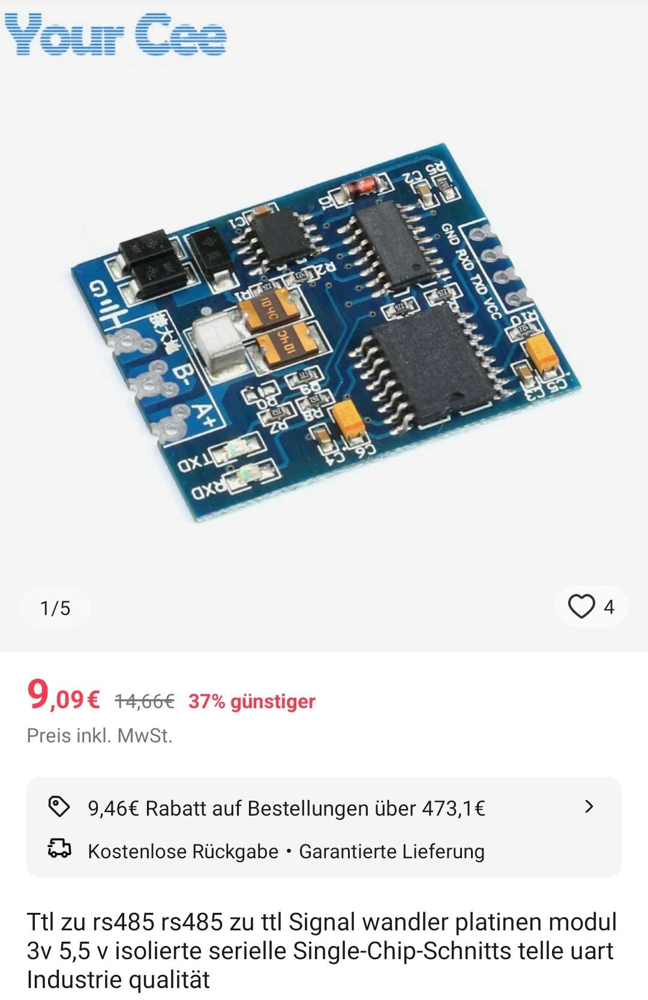
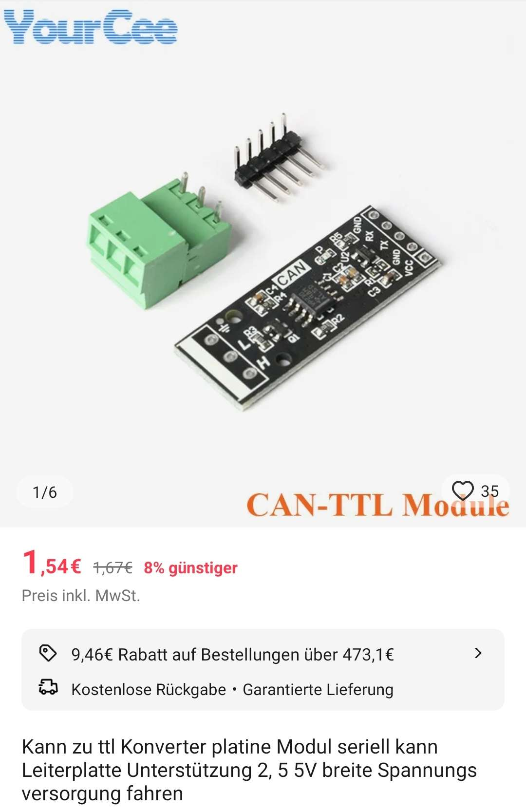

## Grundsätzliches
Es wird nicht empfohlen folgende Bauanleitung für den produktiven Einsatz zu nutzen.  
Diese Anleitung stellt eine Testplattform für eine temporäre Benutzung zur Anschauung des Projektumfangs dar.  
Es kann zu Stabilitätsproblemen mit den verwendeten Boards Drittherstellern kommen.  
Die original Hardware ist erprobt, dafür ausgelegt und vor allem galvanisch getrennt, was gerade bei negativ schaltenden BMS-Typen ein sehr wichtiger Aspekt ist.

## Probleme bei negativ schaltenden BMS
Es gibt einige BMS-Hersteller die den negativen Strompfad bei Auslösung trennen.  
Wenn in diesem Fehlerfall ein anderer GND-Zweig über z.B. "BMS -> RS485 -> BSC -> Inverter" möglich ist, wird der Strom über diese feinen Drähtchen geführt und man steht vor einem Kabelbrand!  
Der Inverter wird dies erst einmal nicht bemerken und versucht seinen Strom weiterhin aus dem Akku zu ziehen!  
Daher unbedingt darauf achten, bei solchen BMS-Typen galvanisch getrennte Module zu verwenden.

## Hardware-Module
Alle Module müssen mit einem 3,3V Pegel des Mikrocontrollers umgehen können und auch von dort aus versorgt werden.

### Das Herz des Ganzen - Der ESP32 Mikrocontroller

#### Modulinfos
Zum erstmaligen Testen kann ein ESP32-Dev-Kit genutzt werden.  
NodeMCUs von verschiedenen Herstellern mit einem ESP32-DOWx (z.B. ESP-WROOM-32) Chipsatz wie z.B. "Berrybase NMCU-ESP32" sind kompatibel.  

#### Spannungsversorgung
Die Spannungsversorgung der NodeMCUs ist leider recht spärlich aufgestellt und kann zu einem instabilen Zustand des Systems führen.  
Um den Boards etwas zu helfen gibt es zwei Dinge zu beachten:
1. Direkter Anschluss dieses mit einem hochwertigen 3,3V / >=1,5A Netzteil an den 3,3V und GND Pin
2. Zusätzlich hierzu sind verschieden große Kondensatoren zwischen diesen Pins sinnvoll - z.B. Kerko: 220nF & Elkos: 22uF, 470uF

#### Modulanschluss Kriterien
Es ist zu beachten, dass je nach Anschluss externer Hardware evtl. passende Pegelwandler einzusetzen sind!  
-> Aus einem ESP32 kommt eine UART mit 3,3V Pegel - Kein RS485! Dies kann unter Umständen den Controller oder die Zielhardware zerstören.

#### GPIOs
In folgender Tabelle ist der Daten-Anschluss der Kommunikations-Module dargestellt.  
Ein Seplos BMS sollte an die Serial2 angeschlossen werden.  

Interface | RX | TX
-------- | -------- | --------
**Serial 0**   | GPIO 16   | GPIO 17
**Serial 1**   | GPIO 23   | GPIO 25
**Serial 2**   | GPIO 35   | GPIO 33
**CAN**   | GPIO 5   | GPIO 4

### RS485-Konverter
Ein galvanisch getrennter und getesteter RS485 Adapter ist z.B. folgender.  
Zu haben von unterschiedlichen Quellen.  
Anzuschließen ist dreiadrig (A / B / GND).  

{ width="450" }

### CAN-Konverter
Für die CAN-Schnittstelle funktioniert in einem Prototypen beispielsweise folgender bisher zuverlässig.  
Zu haben von unterschiedlichen Quellen.  
Anzuschließen ist dreiadrig (CANH / CANL / GND).  

{ width="450" }