## Wichtiger Hinweis! Zuerst lesen!
Die hier aufgeführten Einstellungen und Konfigurationsvorschläge basieren auf Erfahrungswerten von Anwendern und sind speziell für LiFePo4-basierte Zellen entwickelt. Sie dienen lediglich als Orientierungshilfe und stellen einen **Erstentwurf** für eine mögliche Konfiguration mit den beschriebenen Geräten dar.  

Bitte beachten Sie, dass wir keine Gewährleistung oder Garantie für die Richtigkeit, Vollständigkeit oder Anwendbarkeit der bereitgestellten Informationen übernehmen können. Die korrekte Anpassung dieser Einstellungen an Ihr spezifisches System erfordert fundiertes technisches Fachwissen. Es liegt in Ihrer Verantwortung, die bereitgestellten Informationen sorgfältig zu überprüfen, zu verstehen und gegebenenfalls anzupassen, bevor Sie diese in Ihrem System implementieren.  

Wir raten dringend davon ab, die dargestellten Einstellungen unreflektiert zu übernehmen. Nehmen Sie sich die notwendige Zeit, die vorgeschlagenen Konfigurationen in ihrer Gesamtheit zu verstehen und sicherzustellen, dass sie für Ihre individuellen Anforderungen und Systeme geeignet sind. Eine unsachgemäße Anwendung kann zu Schäden an den Geräten, den Batterien oder sogar zur Gefährdung Ihrer Sicherheit führen.  

**Hinweis:** Die Nutzung der hier aufgeführten Informationen erfolgt auf eigenes Risiko. Wir übernehmen keine Haftung für direkte oder indirekte Schäden, die aus der Anwendung der bereitgestellten Einstellungen entstehen könnten.  

## Konfigurations-Beispiele
### 5x JK-InverterBMS 200A (16S); 2x Victron Multiplus 5000

#### BSC - Einstellungen Serielle Schnittstelle

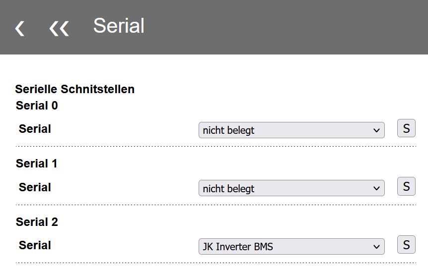{ width="450" }

#### BSC - Einstellungen Inverter
##### Allgemein
Serial 6 wurde hier als Datenquelle (Master) BMS gesetzt, da hier durch die höchste Position im Stack, die höchsten Temperaturen auftreten.  
Diese Temperatur wird genutzt für die Übertragung der "Batterie Temperatur" an Venus OS. Sensor Nummer 1 hatte in dieser Umgebung in der Regel die höchste Temperatur.  
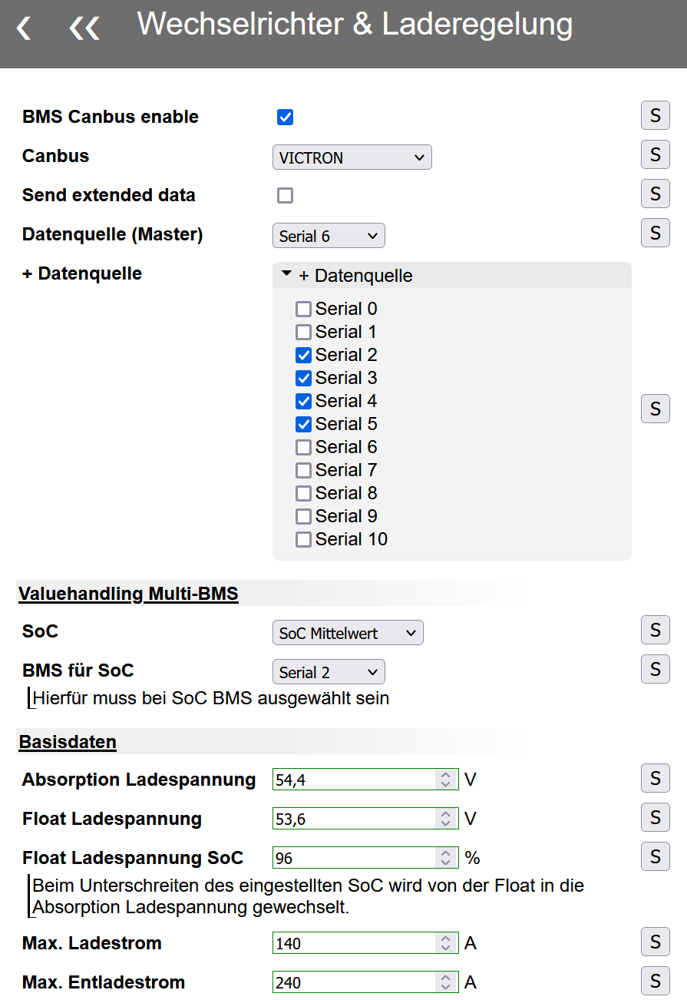{ width="450" }
  
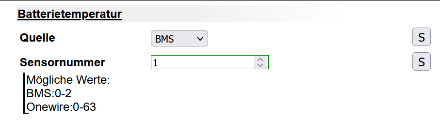{ width="450" }

##### Laden
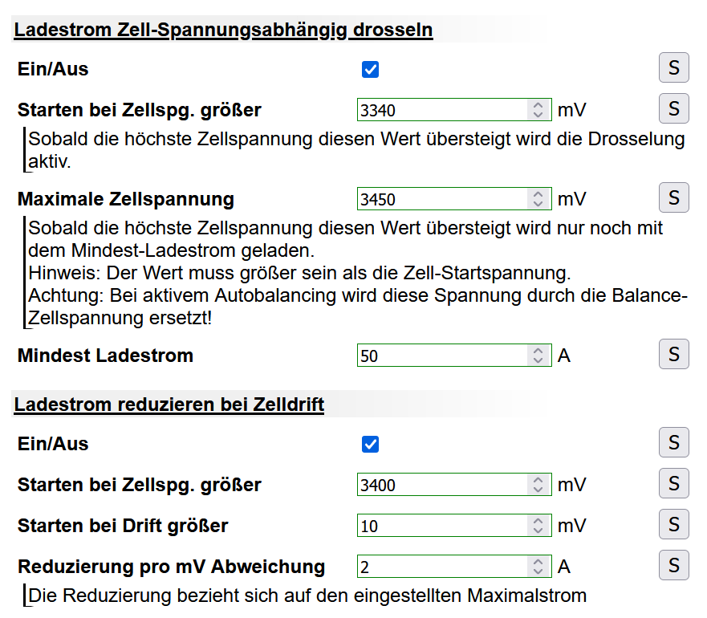{ width="450" }
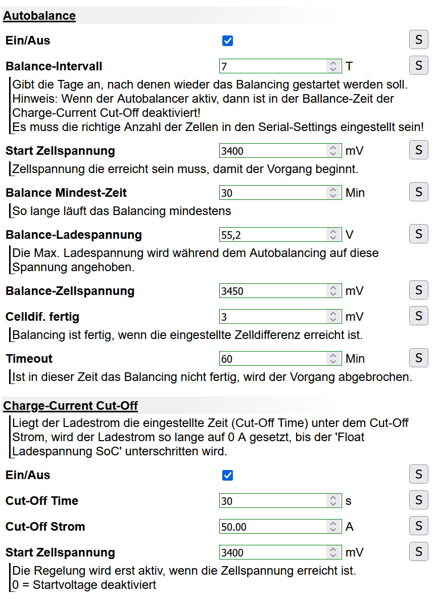{ width="450" }

##### Entladen
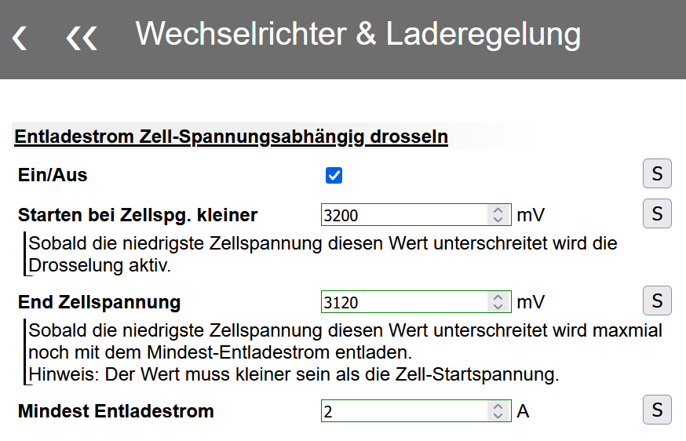{ width="450" }

#### BMS
##### Settings
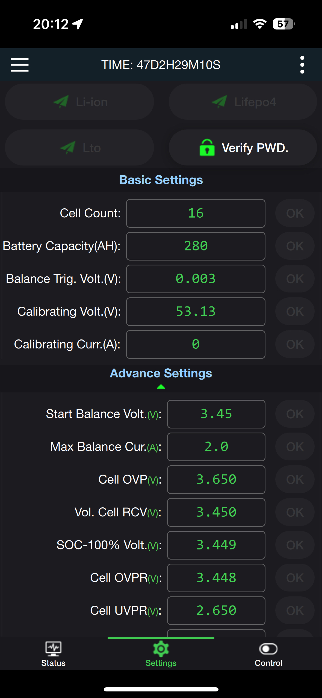{ width="350" }
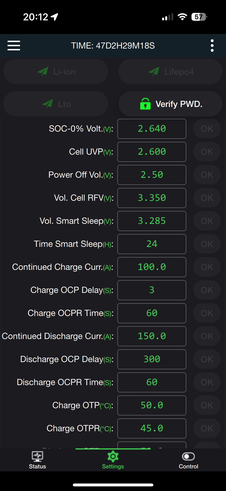{ width="350" }
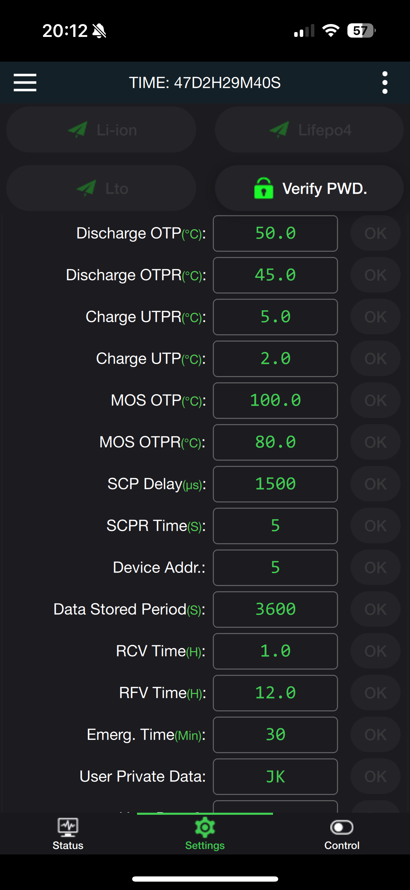{ width="350" }
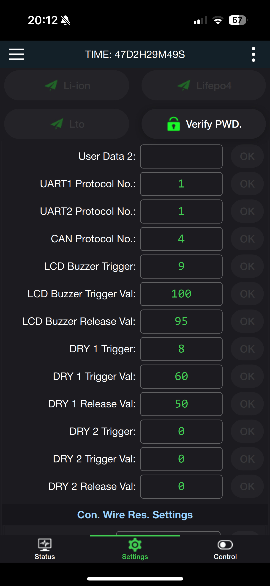{ width="350" }

##### Control
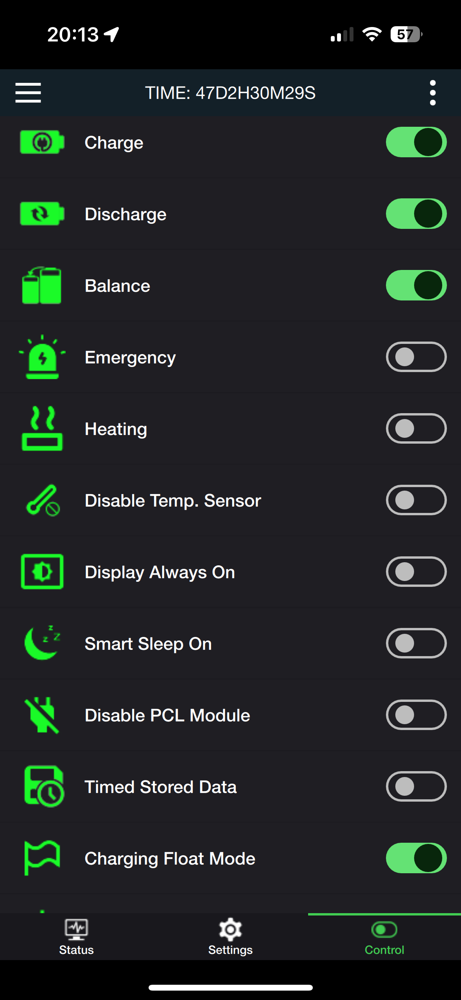{ width="350" }

### 1x Seplos 10E 200A (16S); 3x Growatt SPF5000ES

#### BSC - Einstellungen Inverter
##### Allgemein
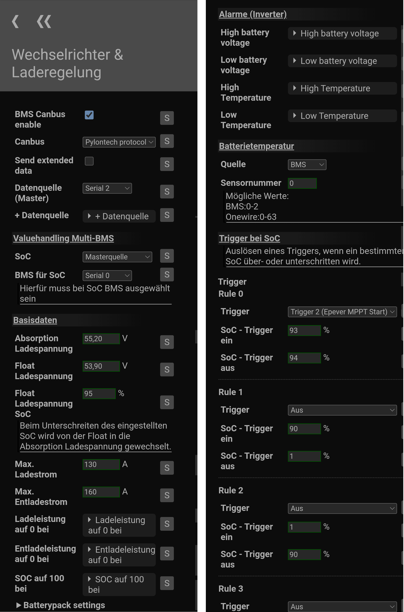{ width="1050" }

##### Laden
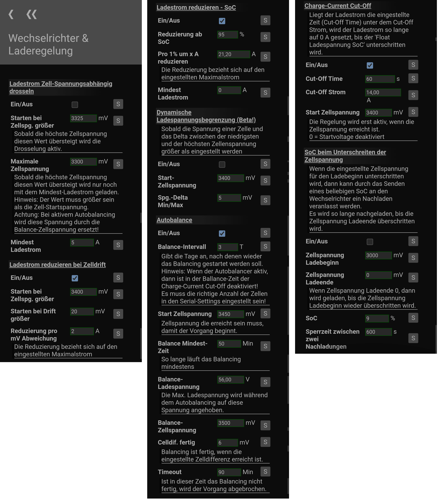{ width="1050" }

##### Entladen
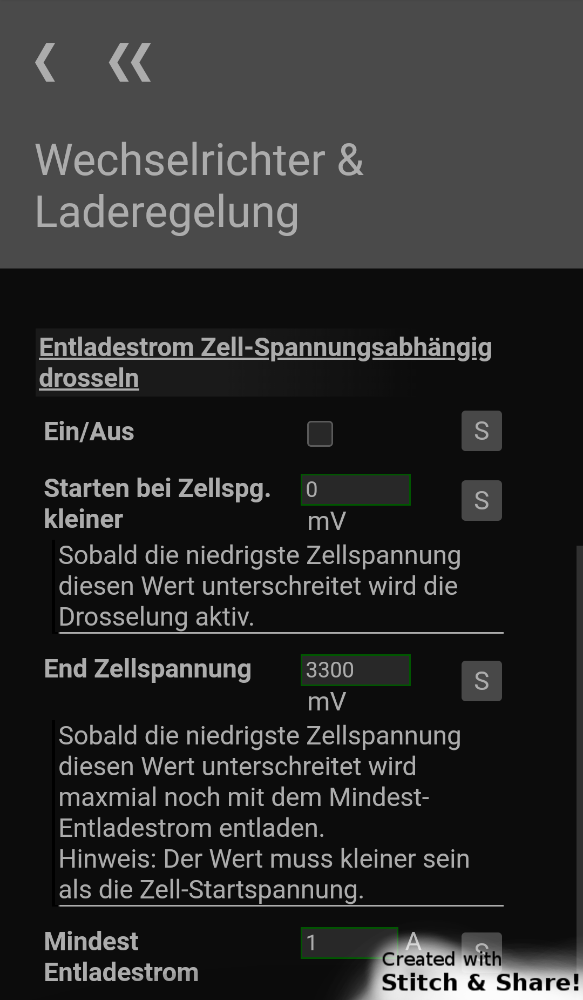{ width="350" }

#### BMS
##### Parameter
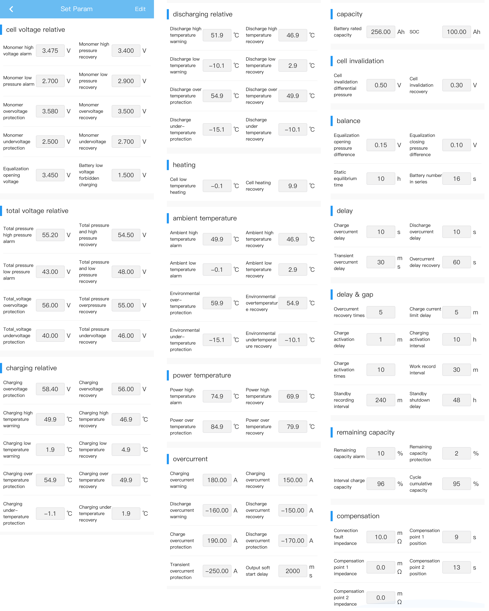{ width="1050" }

##### Switches
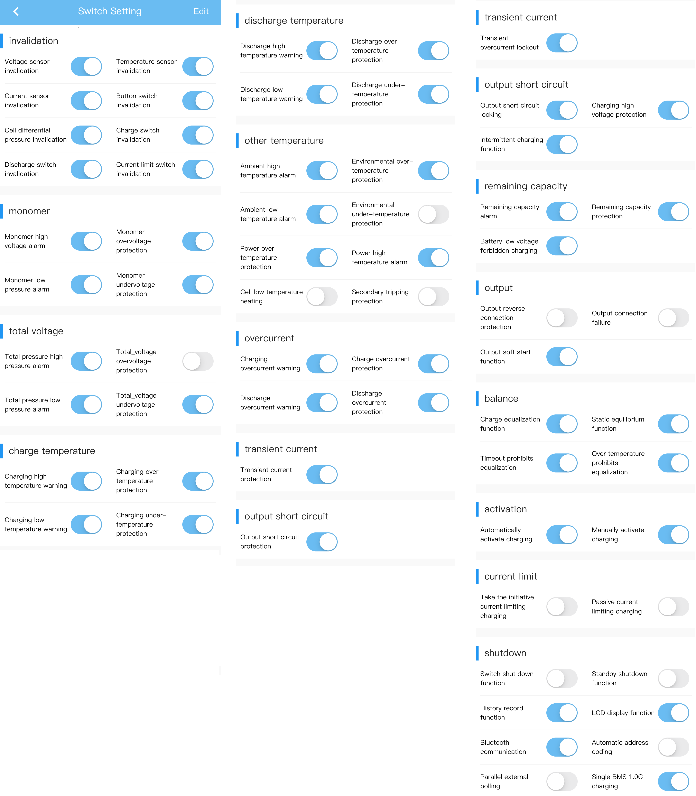{ width="1050" }