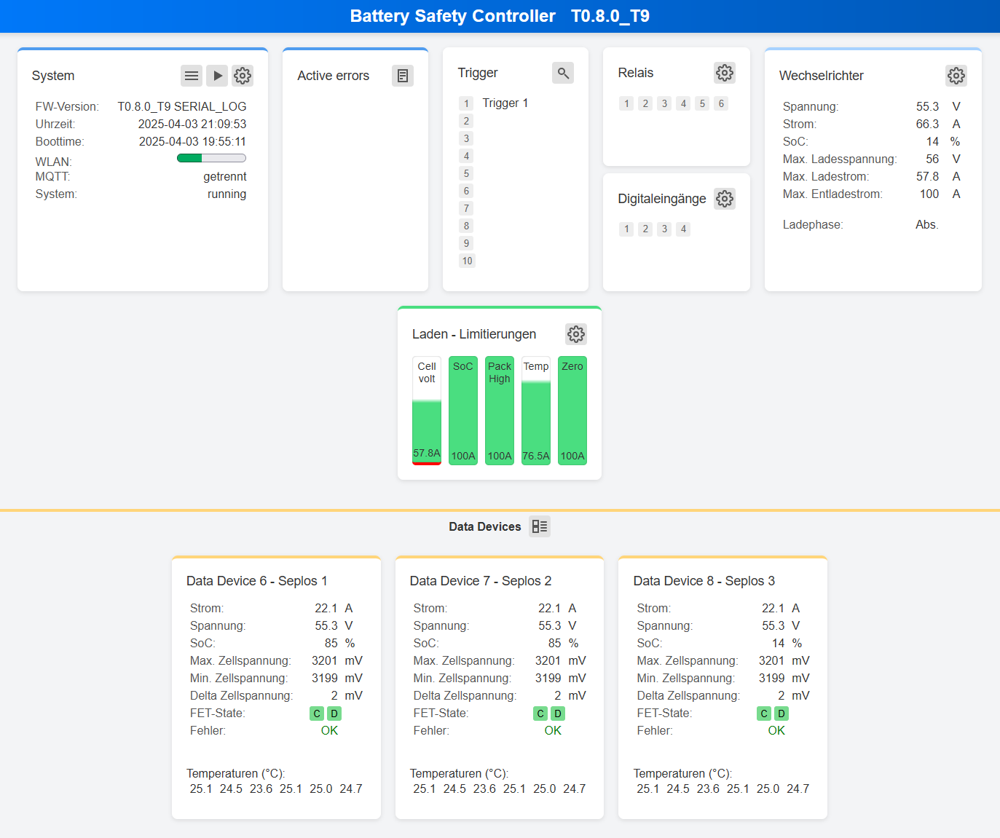

# Dashboard
> Hinweis: Das hier gezeigte Dashboard ist nur in der [Insider Version](insider.md) verfügbar

## Übersicht

Das Dashboard des **Battery Safety Controller (BSC)** bietet einen schnellen Überblick über das gesamte System.  
In einzelnen Kacheln werden relevante Daten zu Systemstatus, Ein- und Ausgängen, Lade- und Entladeregelungen sowie den verbundenen Data-Devices angezeigt.  

{ width="950" }  

## Kacheln
Im Folgenden werden die einzelnen Kacheln und deren Inhalte detailliert beschrieben.

### System
Diese Kachel zeigt den aktuellen Zustand des Systems an.  

**Buttons:**  
 **Menü:** Öffnet das Hauptmenü

 **Live-Daten:** Führt zum Menü für Live-Daten  

 **Einstellungen:** Direkter Zugang zum Systemmenü  

### Active Errors
Diese Kachel zeigt aktive Fehler des Systems an.  

**Hinweis:** Nicht jeder Fehler im Logfile wird als „Active Error“ angezeigt.  

**Mögliche Active-Errors:**  
- Data Device x Error  
- Plausibility Check Error  
- CANBUS Error  

**Buttons:**  
 **Log:** Öffnet das Logfile

### Trigger
Diese Kachel zeigt den Status der konfigurierten Trigger mit den jeweiligen Beschreibungen an.  
Sobald der Trigger aktiv ist, wird die hellgrau hinterlegte Triggernummer dunkelgrau dargestellt.  

**Buttons:**  
 **Trigger-Übersicht:** Führt zu einer detaillierten Ansicht aller verwendeten Trigger und ihrer Funktionen.  

### Relais und Digitaleingänge
Diese Kachelen zeigen den aktuellen Status der Relais und Digitaleingänge an.  
Sobald ein Relais oder Digitaleingang aktiv ist, wird der entprchende hellgrau hinterlegte Ein-/Ausgang dunkelgrau dargestellt.  

### Wechselrichter
Diese Kachel zeigt die an den Wechselrichter gesendeten Daten.  

**Angezeigte Werte:**  
- Spannung (V)  
- Strom (A)  
- SoC (%)  
- Max. Lade- und Entladewerte (V, A)  

Zusätzlich wird die aktuelle Ladephase angezeigt (*Float, Absorption*).  

### Laden – Limitierungen
Diese Kachel zeigt für jede aktivierte Laderegelung einen Balken an, der den maximal erlaubten Ladestrom darstellt.  

**Laderegelungen und deren Bezeichnungen im Dashboard:**  

| Laderegelung                               | Bezeichnung im Dashboard |
|-------------------------------------------|--------------------------|
| Ladestrom Zell-Spannungsabhängig drosseln | **Cell volt** |
| Ladestrom reduzieren – SoC                | **SoC** |
| Ladestrom reduzieren bei Zelldrift        | **Cell drift** |
| Charge-Current Cut-Off                    | **Cut Off** |
| Ladestrom pro Pack zu groß                | **Pack High** |
| Ladestrom reduzieren – Temperatur         | **Temp** |
| Spannungsregelung zur Ladestrombegrenzung | **Zero** |

### Entladen – Limitierungen
Diese Kachel zeigt für jede aktivierte Entladeregelung einen Balken an, der den maximal erlaubten Entladestrom darstellt.  

**Entladeregelungen und deren Bezeichnungen im Dashboard:**  

| Entladeregelung                              | Bezeichnung im Dashboard |
|---------------------------------------------|--------------------------|
| Entladestrom Zell-Spannungsabhängig drosseln | **Cell volt** |

### Data-Devices
Diese Kachel zeigt die Live-Daten der verbundenen Data-Devices an.   

**Buttons:**  
 Über den Button (in der Kopfzeile) kann zur Anzeige der Zellspannungen umgeschaltet werden.  