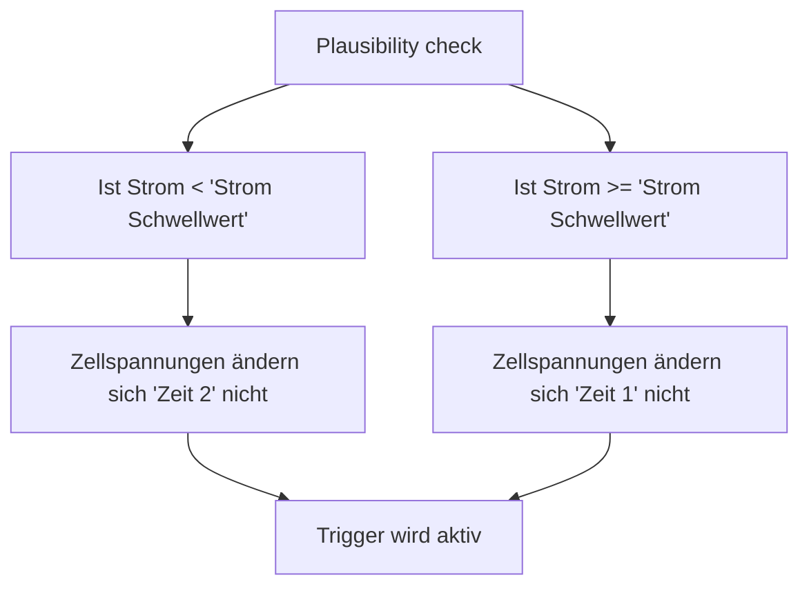

## Allgemeines
Es gibt zwei Version des WebUI's. Das Classic WebUI und das WebUI V2.   
Im folgenden ist das WebUI V2 abgebildet, welches so aktuell nicht zur Verfügung steht. 

### Allgemeine Informationen zur Bedienung
**Speichern der Einstellungen**  
Das Speichern unterscheidet sich in den WebUI's.  

Classic WebUI:  
Die geänderten Einstellungen können mit dem „S"-Button, der in jeder Zeile der Einstellungen ist, gespeichert werden.
Zu beachten ist, dass auch nur die Einstellung in der jeweiligen Zeile des „S"-Button gespeichert wird.  

WebUI V2  
Hier können alle Änderungen über den "Save"-Button in der Headline gespeichert werden. Es muss nicht jeder Änderung einzeln gespeichert werden.

### Funktionsprinzip der Überwachungsfunktionen
In diesem Abschnitt wird erklärt, wie interne Trigger zur Überwachung und Steuerung verschiedener Werte (z. B. Temperatur, Spannung) verwendet werden können, um auf potenzielle Gefahrenzustände zu reagieren.  
  
**Trigger-Funktionalität**  
Für jeden zu überwachenden Wert kann ein Trigger konfiguriert werden, der bei Erreichen eines definierten Grenzwerts aktiv wird. Ein aktivierter Trigger löst selbst zunächst keine direkte Aktion aus. Es kann jedoch flexibel eingestellt werden, welche Aktionen durch den Trigger ausgelöst werden sollen. So kann beispielsweise:

  - ein Relais geschaltet werden (z. B. zum Aktivieren eines Lüfters),
  - der Wechselrichter angewiesen werden, seinen Ladestrom auf 0 A zu reduzieren.


Diese Logik ermöglicht es, Trigger (als Signalgeber) und verbundene Aktionen (als Signalnehmer) in flexibler Weise zu kombinieren. Es stehen bis zu 10 interne Trigger zur Verfügung.

**Funktionsweise bei mehreren Quellen**  
Wenn mehrere Quellen mit einem Trigger verbunden sind, gilt folgende Regel:

  - Aktivierung (High): Der Trigger wird aktiv geschaltet, sobald mindestens eine der verbundenen Quellen den definierten Grenzwert überschreitet.
  - Deaktivierung (Low): Der Trigger wird erst deaktiviert, wenn alle verbundenen Quellen wieder in den Normalzustand zurückgekehrt sind.

> **Hinweis:** Insbesondere bei der Verwendung von virtuellen Triggern (vTrigger) ist darauf zu achten, dass diese durch Automatisierungen gezielt deaktiviert werden müssen, um die Trigger-Funktionalität erneut nutzen zu können.

**Beispielanwendung**

  - Zwei Temperatursensoren (Sensor 2 und Sensor 3) überwachen eine Grenztemperatur von 30 °C. Sobald einer der beiden Sensoren diesen Wert überschreitet, wird Trigger 1 aktiv.
  - Auf Trigger 1 basierend, können zwei Aktionen konfiguriert werden:
      - Relais 1 wird geschaltet, um einen Lüfter zu aktivieren.
      - Der Wechselrichter reduziert automatisch seinen Ladestrom, um die Wärmeentwicklung zu minimieren.

**Zusammenfassung**  
Diese Kombination aus flexiblen Trigger-Quellen und konfigurierbaren Zielaktionen ermöglicht eine präzise und vielseitige Steuerung. Die Logik stellt sicher, dass Gefahren frühzeitig erkannt und geeignete Maßnahmen ergriffen werden können, während die Flexibilität zur Anpassung an individuelle Anforderungen erhalten bleibt.

## Dashboard
Nach dem Aufrufen der Webseite über das integrierte WLAN-Modul (IP oder bsc.info) kommt als Startseite das Dashboard mit ein paar grundlegenden Informationen.  
Über das seitliche Menü kann man zu den jeweiligen Funktionen navigieren.

{ width="950" }    

| Kachel  | Beschreibung |
| ------------- | ------------- |
| System  | Solange auf der Kachel „running" steht, laufen die einzelnen Tasks fehlerfrei.   Sollte ein interner Task seine vorgegebene maximale Zykluszeit überschreiten   kommt hier ein Fehler mit der zugehörigen Tasknummer.  |
| MQTT  | Gibt an, ob eine Verbindung zu dem MQTT Broker besteht  |
| Free Heap  | Zeigt den freien Heap und den jemals niedrigsten freien Heap seit Systemstart an  |
| BT-Devices| Status der angeschlossenen BT-Geräte wie z.B. ein Neey Balancer; "c" bedeutet Connected|
| Trigger | Status der zehn möglichen Trigger; 0=kein Trigger, 1=Trigger |

## Livedaten
{ width="950" }  
"FET state" beschreibt den aktuellen FET Lade-/Entladezustand.  

{ width="300" }  

## System
{ width="950" }  

Hier findet man alle System-Internen Einstellmöglichkeiten, wie z.B. Benutzernamen und Passwörter zu den WLAN und MQTT Logins.  
Bitte beachten Sie, dass das Tilde-Zeichen (~) derzeit als Passwort-Zeichen <u>nicht unterstützt</u> wird.  

### MQTT
{ width="300" }    
Sobald MQTT aktiviert ist und die zugehörige IP-Adresse und der Port eingestellt ist, sendet der BSC zyklisch die Daten an den MQTT-Broker.

**vTrigger**  
Mit "Remanenze vTrigger" kann festgelegt werden, welcher vTrigger als speichernd definiert werden soll. Ein speichernder vTrigger stellt sicher, dass seine Werte auch nach einem Neustart (Reboot) oder einem Spannungsausfall automatisch wiederhergestellt werden.  
Mehr zum Thema vTrigger unter [MQTT](mqtt.md#virtual-trigger).

### Zeitserver
Falls Sie einen externen NTP-Server verwenden und mit der Zeitsynchronisierung Probleme haben, können Sie auch den Router Ihres Netzwerkes hierzu verwenden - Dies funktioniert oft stabiler.  
Am Beispiel einer AVM FritzBox können Sie den Zeitserver im Menü unter Heimnetz/Netzwerk/Netzwerkeinstellungen aktivieren.  
Als Zeitserver können Sie beispielsweise folgendes definieren: "ntp1.t-online.de; 2.europe.pool.ntp.org".  
Im BSC muss dann dessen IP-Adresse angegeben werden.

## Schnittstellen
In den Schnittstellen Einstellungen wird eingestellt was an welcher Schnittstelle angeschlossen ist. Hier wird **nicht** eingestellt was z.B. mit den Daten von einem BMS oder Balancer passieren soll, oder wann der Relais-Ausgang schalten soll. Dies wird dann bei den Einstellungen zu den Alarmregeln oder dem Wechselrichter gemacht.

### Serial
{ width="950" }  
In diesem Abschnitt legen Sie fest, welche Hardware an welchen seriellen Port angeschlossen ist. Darüber hinaus ist es erforderlich, im Abschnitt "Data Device Mapping" zu konfigurieren, welche serielle Schnittstelle welchem internen Daten-Device zugeordnet wird.

Detaillierte Informationen zur Einrichtung des Data Device Mapping finden sie im Kapitel [Data device mapping](#data-device-mapping)  

Diese Konfiguration stellt sicher, dass die angeschlossene Hardware korrekt erkannt und mit den entsprechenden internen Daten-Devices verknüpft wird.

**Zuordnung (Software => Hardware):**

* Serial 0 => U1
* Serial 1 => U2
* Serial 2 => U3

Alle weiteren dargestellten Schnittstellen sind nur mit angeschlossener Serial-Extension nutzbar.  

**Unterstütze Hardware**  
{ width="400" }  
Die Liste der verfügbaren Hardware wird kontinuierlich erweitert, um den Anforderungen und Bedürfnissen unserer Nutzer gerecht zu werden. Das dargestellte Bild dient lediglich zur Veranschaulichung und stellt ein Beispiel dar.

#### Filter
{ width="400" }  
Dieser Filter dient dazu, Sprünge in den Zellspannungen zu erkennen und herauszufiltern. Die Ansprechschwelle des Filters wird als Prozentsatz im Vergleich zum vorherigen gültigen Wert eingestellt. Sobald die Zellspannung den festgelegten Prozentsatz überschreitet, wird der neue Wert nicht übernommen, jedoch auch nicht als Fehler gewertet.

Die Funktion „Anzahl RX Fehler“ ermöglicht es, die Schwelle festzulegen, ab wann eine Zellspannungsabweichung als Fehler betrachtet wird. Sobald die eingestellte Anzahl an Fehlern überschritten wird, erfolgt keine Aktualisierung des Zeitstempels für das letzte gültige Paket mehr im System.

Durch diese Funktionen wird eine präzisere und stabilere Datenverarbeitung gewährleistet, indem temporäre Spannungssprünge gefiltert und eine Verwertung von fehlerhaften Paketen verhindert wird.

#### Plausibility check
{ width="500" }  
Der "Plausibility Check" ist eine wichtige Funktion, die kontinuierlich den Stromfluss sowie die Zellspannungen der an das System angeschlossenen Data-Devices überwacht.  

Wenn sich die Werte für Strom und Zellspannungen über einen längeren Zeitraum hinweg nicht mehr regelmäßig ändern, deutet dies darauf hin, dass das BMS keine gültigen Daten mehr sendet. In diesem Fall kann davon ausgegangen werden, dass ein Problem im BMS vorliegt.

Der "Plausibility Check" bietet so eine frühzeitige Warnung bei Unregelmäßigkeiten und unterstützt die zuverlässige Funktion und Sicherheit des gesamten Systems.  

**Funktionsweise des Plausibility checks**:


#### Value Adjustment für SoC-Übermittlung an den Wechselrichter
{ width="500" }  
Der "Value Adjustment" ermöglicht es, dem Wechselrichter abhängig von der Zellspannung einen angepassten State of Charge (SoC) zu übermitteln. Dabei stehen zwei Betriebsmodi zur Verfügung, die unterschiedliche Anforderungen und Verhaltensweisen abdecken.  

##### Betriebsmodus 1: Feste SoC-Übermittlung bei definierter Zellspannung
In diesem Modus wird die Zellspannung definiert, bei der der Wechselrichter einen SoC von 100% erhalten soll. Wenn die Zellspannung den eingestellten Wert erreicht oder überschreitet, wird der SoC von 100% an den Wechselrichter übermittelt. Sobald die Zellspannung unter den eingestellten Wert fällt, wird der SoC wieder vom Batterie-Management-System (BMS) an den Wechselrichter gesendet.  

**Hinweis:** Für diesen Modus muss das Feld "Cellvoltage for SoC 0%" leer bleiben. Dies stellt sicher, dass nur die obere Schwelle (für 100% SoC) berücksichtigt wird und die Berechnung des SoC allein durch das BMS erfolgt, wenn die Zellspannung unter die festgelegte Schwelle sinkt.  

**Beispiel:**  

- Cellvoltage für SoC 100%: 3,5 V
  - Bei einer Zellspannung von 3,5 V oder höher wird dem Wechselrichter ein SoC von 100% übermittelt.
  - Fällt die Zellspannung unter 3,5 V, erfolgt die SoC-Übermittlung wieder regulär durch das BMS.

##### Betriebsmodus 2: Lineare SoC-Berechnung zwischen zwei Zellspannungsschwellen
In diesem Modus werden zwei Zellspannungsschwellen definiert: Eine obere Schwelle für 100% SoC und eine untere Schwelle für 0% SoC. Wenn die Zellspannung die obere Schwelle erreicht oder überschreitet, wird dem Wechselrichter ein SoC von 100% übermittelt. Erreicht oder unterschreitet die Zellspannung die untere Schwelle, wird ein SoC von 0% übermittelt. Für Zellspannungen zwischen diesen beiden Werten wird der SoC linear berechnet und entsprechend an den Wechselrichter gesendet.  

**Beispiel:**

- Cellvoltage für SoC 100%: 3,5 V
- Cellvoltage für SoC 0%: 2,9 V
  - Bei einer Zellspannung von 3,5 V oder höher wird dem Wechselrichter ein SoC von 100% übermittelt.
  - Bei einer Zellspannung von 2,9 V oder niedriger wird dem Wechselrichter ein SoC von 0% übermittelt.
  - Bei Zellspannungen zwischen 2,9 V und 3,5 V wird der SoC linear berechnet und an den Wechselrichter übermittelt.

Dieser Modus ist besonders nützlich für BMS-Systeme, die keinen eigenen SoC melden, da der SoC in Abhängigkeit von den Zellspannungen automatisch ermittelt wird.  

**Wichtiger Hinweis:** Stellen Sie sicher, dass die eingetragenen Zellspannungen den Spezifikationen des verwendeten Batteriesystems entsprechen, um eine optimale Funktion und Sicherheit zu gewährleisten.

### Data device mapping
{ width="950" } 

Die Data Device Mappings dienen dazu, die Zuordnung der seriellen Schnittstelle oder des Bluetooth-Geräts zu dem internen, im BSC (Battery System Controller) verwendeten Data-Device vorzunehmen.

Hierbei müssen folgende Parameter eingestellt werden:

  - Schnittstelle: Die serielle Schnittstelle oder das Bluetooth-Gerät, das verwendet wird.
  - Adresse des Data-Devices: Die eindeutige Adresse, die dem spezifischen Gerät zugewiesen wird.
  - Name (optional): Ein benutzerdefinierter Name, der in den weiteren Einstellungen des Parameters angezeigt wird. Dieser Name wird außerdem für den MQTT-Topic des jeweiligen Devices verwendet.

Falls mehrere Geräte an einer seriellen Schnittstelle angeschlossen sind und das BMS (Battery Management System) die Verbindung im Daisy-Chain-Modus unterstützt, ist es erforderlich, für jedes Gerät die korrekte Adresse zu definieren. Nur so kann eine eindeutige Zuordnung und eine fehlerfreie Kommunikation zwischen dem BMS und den Geräten sichergestellt werden.

> **Hinweis:** Die korrekte Konfiguration der Data Device Mappings ist essenziell, um eine störungsfreie Funktionalität zu gewährleisten. Beachten Sie die Adressierungsregeln Ihres BMS-Systems.

### Relaisausgänge
{ width="950" }  
Hier können die grundlegenden Einstellungen zu den Relaisausgängen vorgenommen werden.

* **Auslösung bei**
  Hier wird angegeben bei welchem kommenden Trigger das Relais schalten soll
* **Auslöseverhalten**
    * Permanent: Das Relais bleibt angezogen, solange der Trigger ansteht
    * Impuls: Das Relais schaltet für eine Dauer von x ms. Die Impulsdauer wird unter "Impulsdauer" eingestellt.
* **Impulsdauer**
  Hier wird die Impulsdauer eingestellt, wenn bei dem Auslöseverhalten "Impuls" eingestellt wurde.
* **Verzögerung**
  Gibt an um wie viel Sekunden das Schalten des Relais bei einem kommenden Trigger verzögert werden soll.
* **Invertieren**
  Die Option ermöglicht es, den Relaisausgang flexibel zwischen den Betriebsmodi NO (Normally Open) und NC (Normally Closed) umzuschalten. Durch Aktivieren dieser Option wird die Logik des Relaisausgangs umgekehrt, sodass bei der Ausführung des Schaltvorgangs der alternative Zustand genutzt wird. Diese Funktion ist besonders nützlich, um die Kompatibilität mit verschiedenen Steuerungsanforderungen oder Schaltungsdesigns sicherzustellen.

Die Logik mit den Triggern zieht sich durch das gesamte System. Es gibt Trigger-Geber, z.B. die Digitaleingänge  und es gibt Trigger-Nehmer, z.B. die Relaisausgänge.

### Digitaleingänge
{ width="950" }  
Hier können die grundlegenden Einstellungen zu den Digitaleingängen vorgenommen werden.

* **Eingang invertieren**
  Hier kann der Eingang invertiert werden
* **Weiterleiten an**
  Hier kann der Trigger eingestellt werden, auf den der Eingang geht.   Wenn der Eingang High wird, dann wird der hier eingestellte Trigger aktiv.  Ist der Eingang invertiert, dann wird bei einem Low am Eingang der Trigger aktiv.
 
### Onewire
{ width="950" }  
Hier werden die Adressen der Onewire Temperatursensoren festgelegt.    

Der Controller scannt, sobald diese Onewire- Konfigurationsseite aufgerufen ist, zyklisch den Bus nach Onewire-Devices und zeigt diese am  unteren Ende der Seite an.  
Die Fett dargestellten Devices am unteren Rand sind neue Devices, die noch nicht in der Onewire-Konfigurationsseite gespeichert sind.  
Dadurch lassen sich neu angeschlossene Sensoren leichter identifizieren.  

{ width="950" }  

### Onewire II
{ width="950" }  
Hier kann ein Offset zu den jeweiligen Onewire-Temperatursensoren eingestellt werden.

### Bluetooth
**Bluetooth steht aktuell nicht zu Verfügung!**  
{ width="950" }  
Hier können bis zu 7 Bluetooth Devices festgelegt werden, von denen der Controller Daten holt.  
Dazu muss der Device-Typ und die MAC-Adresse (in Kleinbuchstaben) eingestellt werden.  

Der Controller scannt, sobald diese Konfigurationsseite aufgerufen ist, zyklisch nach neuen BT-Devices   
und zeigt die letzten 5 gefundenen am unteren Ende der Seite an.  

**Unterstützte Hardware**  
{ width="400" }  

## Alarmregeln 
In den Alarmregeln kann eingestellt werden, welche Daten von welchen Devices überwacht werden sollen.  

### BMS
{ width="950" }   
Die BMS Alarmregeln ermöglichen die Überwachung der konfigurierten Data-Devices. Es können verschiedene Parameter des Data-Device überwacht werden, um Alarme zu konfigurieren und automatische Aktionen auszulösen, wenn bestimmte Schwellenwerte erreicht werden.
  
Der Spannungs-Trigger wird ausgelöst, wenn die Spannung unter den festgelegten "Min"-Wert fällt oder den "Max"-Wert überschreitet. Um unnötige Alarme aufgrund kleiner Schwankungen zu vermeiden, kann eine einstellbare Hysterese hinzugefügt werden, die den Trigger "beruhigt" und erst bei signifikanten Änderungen aktiviert wird.

Die folgenden Überwachungsfunktionen stehen zur Verfügung:

| Überwachungsfunktion | Option | Beschreibung |
| :------------ | :------------ | :------------ |
| **Keine Daten vom BMS** |  |  |
|  | Trigger keine Daten | Aktivieren/Deaktivieren der Überwachungsfunktion |
|  | Aktion bei Trigger | Gibt an welcher Trigger ausgelöst werden soll |
|  | Trigger keine Daten | Wenn x Sekunden keine Daten kommen, dann wird Trigger ausgelöst  |
| **Spannungsüberwachung Zelle Min/Max** |  |  |
|  | Spg.-Überwachung | Aktivieren/Deaktivieren der Überwachungsfunktion |
|  | Aktion bei Trigger | Gibt an welcher Trigger ausgelöst werden soll |
|  | Anzahl Zellen Monitoring | Anzahl der Zellen die Überwacht werden sollen.  Es wird immer bei der ersten Zelle begonnen. |
|  | Zellspannung Min | Überwachungs-Untergrenze |
|  | Zellspannung Max | Überwachungs-Obergrenze |
| **Spannungsüberwachung Gesamt Min/Max** |  |  |
|  | Aktion bei Trigger | Gibt an welcher Trigger ausgelöst werden soll |
|  | Spannung Min | Überwachungs-Untergrenze |
|  | Spannung Max | Überwachungs-Obergrenze |

### Temperatur
{ width="950" }  
An dieser Stelle können die Einstellungen für die Überwachung der Temperaturwerte der Data-Devices und Onewire-Temperatursensoren konfiguriert werden. 

| Option | Beschreibung |
| :------------ | :------------ |
| Quelle | Hier kann festgelegt werden, ob die Temperaturdaten von einem Data-Device oder von den OneWire-Sensoren bezogen werden.
| Sensornummer&nbsp;von<br>Sensornummer&nbsp;bis  | Hier können die zu überwachenden Onewire-Sensoren durch Angabe eines Bereichs (von/bis) festgelegt werden. Die Sensornummern beziehen sich auf die Nummern der Onewire-Sensoren.  |
| Überwachung | Hier kann eine Überwachungsfunktion eingestellt werden.  Je nach Überwachungsfunktion haben die Felder Wert 1+2 eine andere Funktion |
| Referenzsensor<br>Wert 1<br>Wert 2 | Spezifische Funktion, je nach eingestellter Überwachung |
| Auslösung | Gibt an welcher Trigger ausgelöst werden soll.  Foraussetzung ist, dass eine Überwachungsfunktion ausgewählt wurde |

**Überwachungsfunktionen:**

* **nicht belegt**  
Die Überwachung ist deaktiviert

* **Maximalwert-Überschreitung**  
Es wird überwacht ob einer der Sensoren den maximal erlaubten Temperaturwert überschreitet.  
Die maximale erlaubte Temperatur wird mit dem "Wert 1" festgelegt.
  * Referenzsensor: -
  * Wert 1: Maximal erlaubte Temperatur
  * Wert 2: -

* **Minimalwert-Unterchreitung**  
Es wird überwacht ob einer der Sensoren den minimal erlaubten Temperaturwert unterschreitet.  
Die minimal erlaubte Temperatur wird mit dem "Wert 1" festgelegt.
  * Referenzsensor: -
  * Wert 1: Minimal erlaubte Temperatur
  * Wert 2: -

* **Maximalwert-Überschreitung (Referenz)**  
Es wird überwacht ob einer der Sensoren den maximal erlaubten Temperaturwert überschreitet.  
Die maximale erlaubte Temperatur gibt der unter "Referenzsensor" festgelegte Sensor vor.
  * Referenzsensor:  Sensornummer des Onewire-Temperatursensors
  * Wert 1: Maximal erlaubte Temperaturdifferenz
  * Wert 2: -

* **Differenzwert-Überwachung**  
Es wird die maximale Temperaturabweichung der Sensoren untereinander überwacht.  
Ist die Differenz zwischen dem Niedrigsten und höchsten Wert zu groß, wird der Trigger ausgelöst.
  * Referenzsensor: -
  * Wert 1: Maximal erlaubte Temperaturdifferenz
  * Wert 2: -


### Derzeit aktive Inverter-Drosselung
Welche eingestellte Drosselung gerade aktiv ist, können Sie mit Hilfe der Restapi einsehen.  
Hierzu nach der IP-Adresse des BSC "/restapi" hinzufügen (z.B. 192.168.1.100/restapi).  

Die dargestellten "cc_"-Werte und "dcc_"-Werte stellen den durch die jeweilige Laderegelung limitierten Strom dar.

{ width="250" }  

Falls es nicht möglich ist, die Daten während eines Drosselungs-Events direkt anzuzeigen, besteht die Möglichkeit, diese temporär über eine alternative Plattform wie Home Assistant aufzeichnen zu lassen. Dabei ist zu beachten, dass jede Abfrage der REST-API alle verfügbaren Daten umfasst.

Für die Übertragung der Daten kann mit einer Dauer von etwa 0,5 bis 1 Sekunde pro Paket gerechnet werden. Diese Zeitangabe dient als Orientierung.

Nachfolgend finden Sie ein Beispiel für einen YAML-Code, der für die Erstellung eines Sensors zur Anzeige des Werts von "setpoint_cc" in Home Assistant verwendet werden kann:

```yaml
platform: rest
name: bscapi_setpoint_cc
resource: http://192.x.x.x/restapi
value_template: "{{ value_json['inverter']['setpoint_cc'] }}"
unit_of_measurement: "A"
state_class: "measurement"
icon: "mdi:api"
```

## Firmware-Update
Ein Firmware-Update kann direkt über das Menü angestoßen werden.  
Informationen zum aktuellen Release-Stand, wie auch die dazu passende Beschreibung der Änderungen wird live angezeigt.  
Korrekt gesetztes Netzwerk-Gateway ist für die Live-Infos vorausgesetzt.

{ width="400" }  
