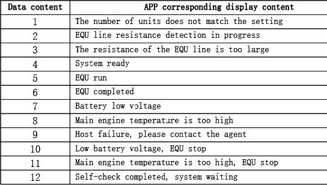
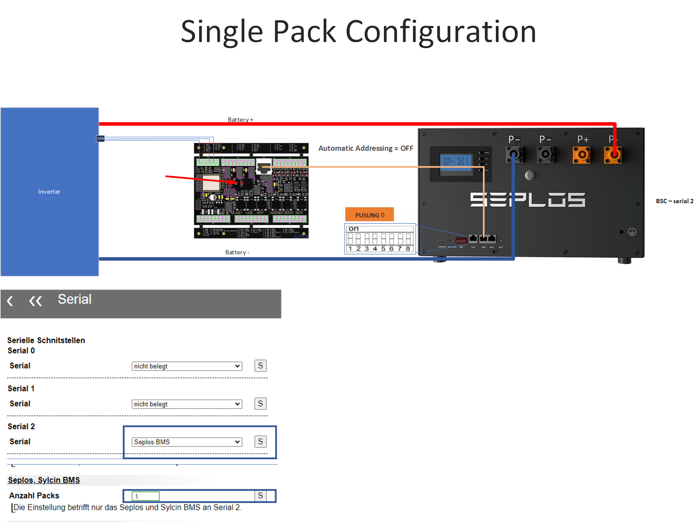
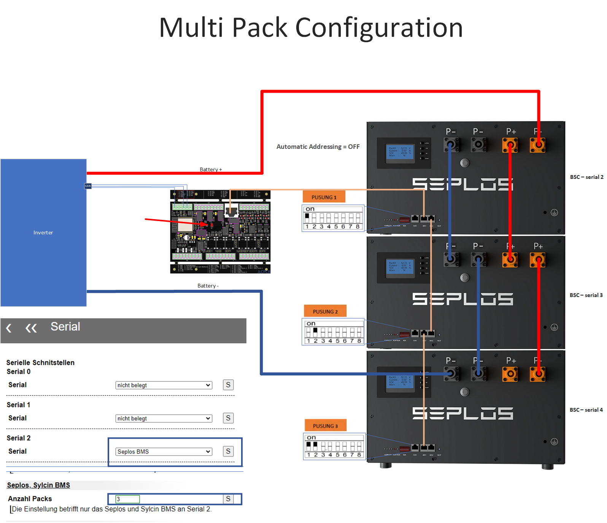
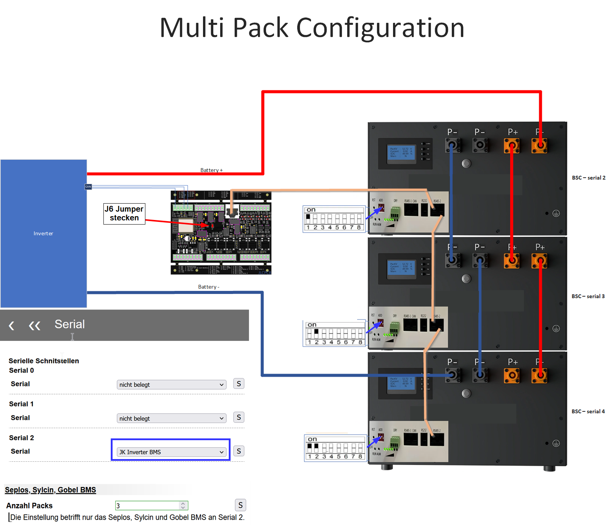
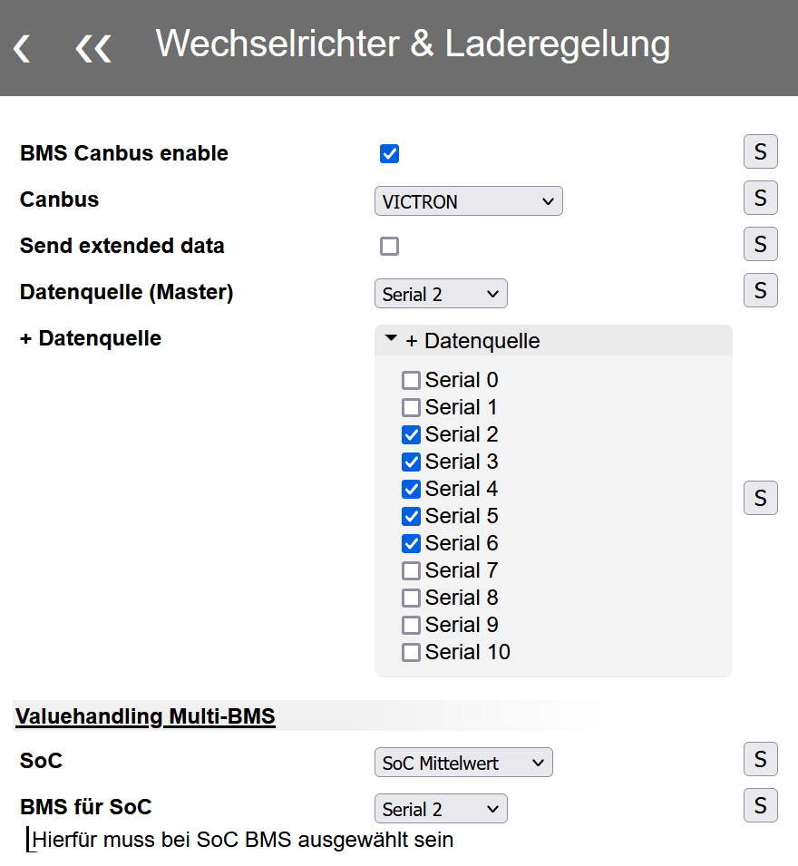
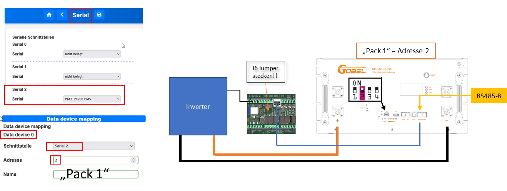
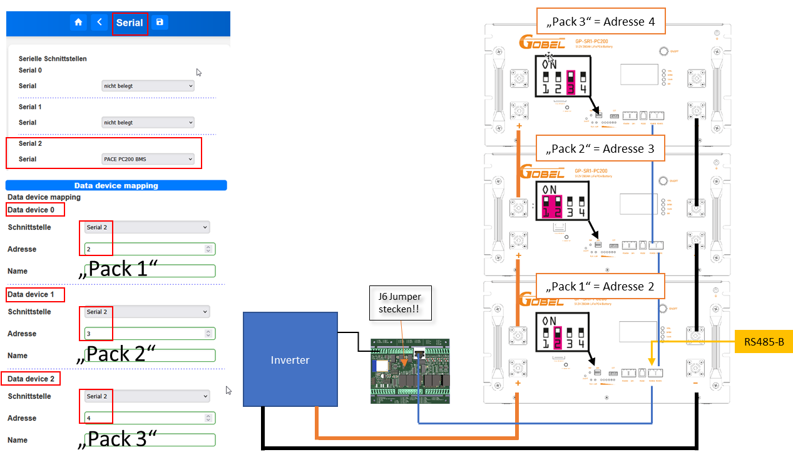

# Unterstützte BMS
In diesem Abschnitt finden Sie eine Übersicht über die unterstützten Battery Management Systeme (BMS). Die Tabelle enthält wichtige Informationen zu den Adressen, die für die Konfiguration erforderlich sind.  
Für eine korrekte Konfiguration sind in den entsprechenden Feldern die Adressen des BMS und DDM (Data-Device-Mapping) angegeben. Diese Adressen sind durch ein / getrennt.

- **Adresse Singlepack**: Diese Adresse ist diejenige, die sowohl am BMS als auch im Device-Data-Mapping eingestellt werden muss. Sie repräsentiert die spezifische Adresse für ein einzelnes BMS in einem System.

- **Adresse Multipack**: Diese Adresse ist die Start-Adresse, die am BMS sowie im Device-Data-Mapping konfiguriert wird. Sie gibt die Adresse des ersten BMS in einem Multipack-System an. Weitere BMS in der Kette erhalten automatisch fortlaufende Adressen basierend auf dieser Start-Adresse.

## Serial BMS
| Typ | HW-Version | SW-Version | Adresse Singlepack BMS / BSC| Adresse Multipack BMS / BSC | Anschluss BMS |
| ------------ | ------------ | ------------ | ------------ | ------------ | ------------ |
| **Jiabaida/JBD** |
| JBD-DP24S002 |  |  | - | - |
| **JK Smart-BMS** |
| JK-B2A20S20P | V11.XW | 11.25H | - | - |
| JK-B2A24S20P | V10.XW | V10.09 | - | - |
| **JK Inverter-BMS** |
| [JK-PB1A16S15P](#jk-inverter) | V14 | V14.20 | 1 / 1 | 1 / 1 |
| [JK-PB1A16S15P](#jk-inverter) | V15 | V15.17 | 1 / 1 | 1 / 1 |
| [JK-PB2A16S20P](#jk-inverter) | V15 | V15.17 | 1 / 1 | 1 / 1 |
| **Seplos** |
| [Seplos](#seplos)| 10C |  | 0 / 0 | 1 / 1 |
| [Seplos](#seplos) | 10E | 16.4 | 0 / 0 | 1 / 1 |
| Seplos V3    |  |  | ? | ? |
| **Sylcin (z.B. Taico Akku)** |
| [Sylcin](#sylcin) |  |  | 0 / 1 | 0 / 1 |
| **Gobel** |
| GP-SR1-RN150 |  | | ? | ? |
| [GP-SR1-PC200](#pace-pc200) |  | |  2 / 2 | 2 / 2 | RS485B |

## Bluetooth Devices
| Typ | HW-Version | SW-Version |
| ------------ | ------------ | ------------ |
|NEEY |
| NEEY Balancer 4A | 2.8.0 | 1.2.1 |
| NEEY Balancer 4A | 2.8.0 | 1.2.3 |

Anbei die Auflösung der Statusmeldungen des NEEY:

{  width="520" }

## Anbindungs-Beispiele

### Seplos

Der BSC unterstützt die Integration eines einzelnen Seplos BMS sowie mehrerer Seplos BMS, die in einer Daisy-Chain-Konfiguration parallel geschaltet werden können. In beiden Fällen wird lediglich ein einzelner serieller Anschluss am BSC benötigt.

#### Bedingungen / Tipps für einen MultiPack Daisy-Chain-Verbund:
* In der Seplos Software ist die automatische Adressierung deaktiviert (Upload Parameter -> auf der rechten Seite ganz nach unten)
* Die DIP Switch sind auf RS485 Konfiguration zu schalten
* Verbinden des BMS mit einem beliebigen Serialport des BSC  
Hinweis: [JP6](../hardware.md#j6-fur-den-regularen-betrieb) muss geschlossen sein.
* Falls es zu einem Problem im Verbund mit plötzlich nicht mehr antwortenden Seplos-BMS kommt, kann die Firmware 16.06.04 (oder evtl auch neuere) evtl. Abhilfe schaffen. Bei dem teilweise vorkommenden Problem lassen die BMS keine serielle Verbindung mehr zu, was nur mit einem BMS-Reboot wieder zu beheben ist.

#### Anschlussmöglichkeiten grafisch dargestellt

**Bei einer Kontaktierung über den RJ45 Anschluss muss [dieser](../hardware.md#j6-fur-den-regularen-betrieb) Jumper gesetzt werden.**

#### Besonderheiten

##### Zuordnung der Temperatursensoren in MQTT

| Datentopic  |Sensorname   |
| :------------ | :------------ |
|0-3 |Externe Kabelsensoren   |
|4   |Mosfet   |
|5   |Umgebung   |

##### Errorhandling
- Eine BSC-Warning ist im Seplos BMS eine "Warning" oder ein "Alarm"
- Ein BSC-Alarm ist im Seplos BMS eine "Protection"

#### Weiterführende Informationen
[Anleitung Firmware Update](../files/SEPLOS_BatteryMonitor_Firmware_updating_Guide.pdf)  
[FAQ Sammlung](https://akkudoktor.net/t/seplos-bms-faq-sammlung/8843) (Akkudoktor)

### Sylcin

Anschluss von mehreren Akkus über Serial 2 vom BSC ist möglich. 

* Die Adressierung 1 aufwärts (ohne lücken) über die Dipschalter einstellen. Hierbei beachten, dass 0000 = Adresse 1, 0001 = Adresse 2 ist!
* BSC mit der Schnittstelle RS485-1 (nicht RS485-2) verbinden. 
* Jeder weitere Akku muss auch parallel an den jeweiligen RS485-1 angeklemmt werden. 
* Beim RS485-1 wird immer Pin 4 und 5 verwendet. 
* Beim RS485 Anfang und Ende des Bus mit einem 120Ohm Widerstand terminieren. 
* Bei einer Kontaktierung über den RJ45 Anschluss muss [dieser](../hardware.md#j6-fur-den-regularen-betrieb) Jumper gesetzt werden
* Einstellen des Sylcin BMS unter Serial 2
* Anzahl der Packs in den Einstellungen festlegen (siehe Bilder Seplos BMS)

Danach ist jedes Pack im BSC zu finden. Akku 1 -> BMS(2), Akku 2 -> BMS(3), ... 

### JK Inverter

Das JK Inverter BMS kann mit einem handelsüblichen RJ45-Patchkabel mit dem BSC verbunden werden.  
Dieser BSC-Port wird in der Software mit "Serial 2" benannt. Für die Benutzung dieser Schnittstelle muss JP6 geschlossen sein.  
Einzelne BMS, wie auch eine MultiPack-Konfiguration über DaisyChain ist möglich.  

#### Einstellung für DaisyChain in der JK App
* Bei einem DaisyChain-Verbund muss das UART Protokoll auf allen BMSen auf Protokoll 1  (JK BMS RS485 Modbus V1.0) umgestellt werden. 

#### Adressierung
Das BSC übernimmt die Rolle des Masters, die DIP Adresse 0 darf dadurch also nicht mehr an ein BMS vergeben werden.  
Jedes Pack bekommt eine eigene ID, welche über die DIP-Schalter zu definieren ist. Keine Adresse darf doppelt vergeben werden.  

#### Physikalische Verbindung 

##### Einzel-Pack-Konfiguration
* Das JK BMS wird mit einem Patchkabel von einem rechten RJ45-Anschluss mit dem BSC verbunden.

##### MultiPack-Konfiguration als in Reihe geschalteten DaisyChain-Verbund
* Alle AkkuPacks über die rechten RJ45-Buchsen miteinander in Reihe verbinden
* Den BSC mit einem Patchkabel zu einem der freien rechten RJ45-Anschlüsse des JK-BMS verbinden

#### RS485 Datenübertragung (BMS) in der BSC-Software konfigurieren 
* Bei Direktanschluss über Serial2: Im BSC unter Einstellungen -> Schnittstellen ->  Serial2 das "JK Inverter BMS" auswählen, da nur eine Schnittstelle für mehrere Packs im DaisyChain-Verbund genutzt werden muss. 
* Die Device-Mapping-Konfiguration der angeschlossenen Geräte wird [hier](../settings_bsc.md/#data-device-mapping) erläutert  
* Danach sollte jedes Pack im BSC z.B. unter den Livedaten -> BMS Daten zu finden sein.  

#### CAN Datenübertragung (Inverter) konfigurieren
Für die Übertragung der Daten per CAN an z.B. ein Victron CerboGX, müssen Sie unter "Einstellungen -> Wechselrichter & Laderegelung -> Allgemein" folgende Einstellungen vornehmen:
 1. BMS Canbus enable selektieren
 2. CAN Protokoll auswählen z.B. VICTRON
 3. Nun die "Datenquelle (Master)" auf Serial 2 definieren
 4. Unter "Valuehandling Multi-BMS" festlegen, wie der SoC zu übertragen / berechnen ist. "Mittelwert" z.B. übergibt den Mittelwert über alle angeschlossenen BMS.
 5. Datenquelle (Master) auswählen (darauf bezieht sich z.B. die Temperatur unter dem Punkt "Battery Temperature" an Victron gesendet werden, die Max und Min Temperaturen über alle Packs hinweg, bleiben davon unberührt) und für jedes weitere BMS unter "+Datenquelle" eine weitere Serielle Schnittstelle entsprechend auswählen.  

{  width="550" }

#### Besonderheiten
##### Zuordnung der Temperatursensoren

Das JK-Inverter BMS besitzt vier anschließbare Temperatursensoren. Diese werden in der BSC-Software wie folgt zugeordnet:

| BSC ID| BMS
| ------------ | ------------ |
| 0 | T1 |
| 1 | T2 |
| 2 | MOS |
| 3 | T4 |
| 4 | T5 |

Ab V0.7.2_T4:

| BSC ID| BMS
| ------------ | ------------ |
| 0 | MOS |
| 1 | T1 |
| 2 | T2 |
| 3 | T4 |
| 4 | T5 |

### Pace PC200

Das Pace PC200 BMS ist beispielsweise in den von Gobel Power verkauften GP-SR1-PC200 Akkupacks verbaut.  
Der BSC unterstützt hier das einzelne Pack, wie auch die Anbindung mehrerer Packs als DaisyChain-Verbund. In beiden Fällen wird lediglich ein einzelner serieller Anschluss am BSC benötigt.  
Als Verkabelung zum BSC kann ein handelsübliches RJ45-Kabel verwendet werden. Der Port am Akku-Pack ist auf den folgenden Bildern ersichtlich und mit RS485-B auf dem Pack gekennzeichnet.  
Die jeweilige Schnittstelle ist unter den seriellen Port-Einstellungen, wie auch im DeviceMapping zu definieren.  

#### Einzel-Pack-Konfiguration

Bei einer Einzel-Pack-Konfiguration fungiert das BSC als Master (Adresse 1), daher bekommt das angeschlossene Akku-Pack per Dipswitch die Adresse 2 zugeteilt.

#### Multi-Pack-Konfiguration

Auch bei einer Multi-Pack-Konfiguration fungiert das BSC als Master (Adresse 1).  
Die weiteren angeschlossenen Packs erhalten aufsteigend die Adressen 2 und folgende.

