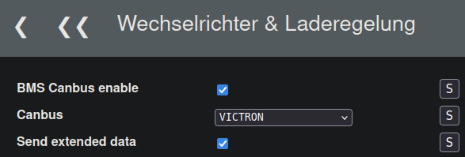
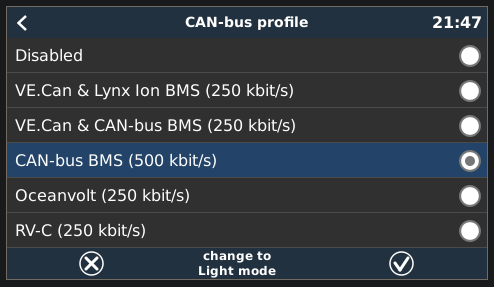
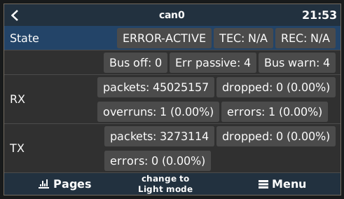
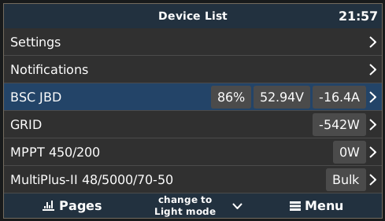
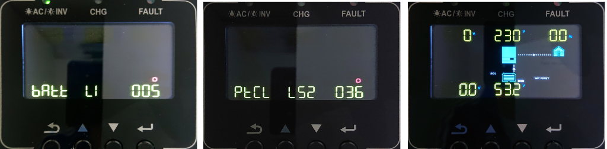
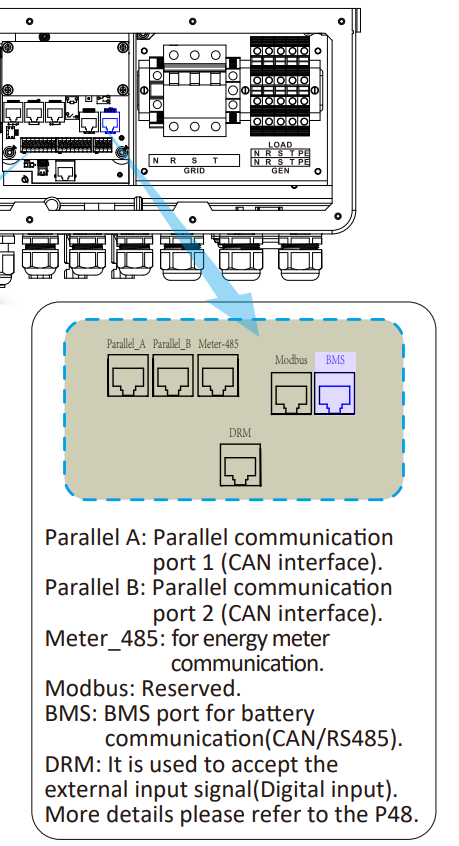
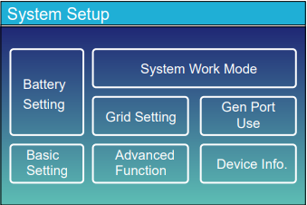
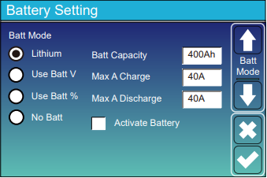
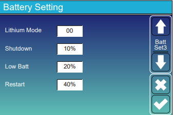

## Victron MP2 48/5000/70 
**Andere Typen des Wechselrichters sind vermutlich im gleichen Stil anzubinden.**

### Physische Verbindung der Komponenten

* Victron interne Verkabelung   
MP2 <-> MK3-USB-Adapter <-> VenusOS (z.B. CerboGX, RaspberryPi + CAN-Shield)   

* Anschluss des BSC  
BSC (CAN-Anschluss) <-> CerboGX / RaspberryPi + CAN-Shield    

### CAN-Verbindung

Bitte darauf achten, dass der bei Victron beiliegende RJ45-Abschlusswiderstand am Anschlussende, zumeist der Cerbo, gesetzt ist.  

* H auf H
* L auf L
* GND auf GND

|CAN|[Victron VE.Can Port](https://www.victronenergy.com/live/battery_compatibility:can-bus_bms-cable)|
|---|---|
|CAN-GND|Pin 3|
|CAN-L|Pin 8|
|CAN-H|Pin 7|

### Einstellungen BSC
Einstellungen -> Wechselrichter & Laderegelung (Inverter) -> Allgemein  

Die Option "Send extended data" hat nur in Verbindung mit dem [dbus-bsc-can](https://github.com/shining-man/dbus-bsc-can) eine Funktion.  

In Verbindung mit einem CerboGX ist die Option **nicht zu empfehlen**, da diese Hardware zu wenig Performance hat und es dadurch zu Problemen kommen kann.  
Die Probleme können sein, dass bei gesetzter Funktion in seltenen Fällen ein SOC von 0% für ca. 30s übermittelt wird!

### Einstellungen VenusOs
Menü -> Settings -> Services -> can[0,1,2,3,...] -> Can Bus-Profile  
  

Network status wenn alles klappt  
  

Alles wird erkannt  

### BSC Log-Ausgabe wenn Inverter erkannt wurde

### Bekannte Besonderheiten
#### Akku wird in das Netz entladen
Der SoC erreicht 100% und wird beim Wechsel auf die Float-Voltage wieder entladen.  
Grund: Dies ist ein vom **BSC unabhängiges Verhalten**. Wenn in den Victron Einstellungen die Option „Gleichstromgekoppelte PV-Einspeisung von Überschuss“ mit ESS aktiviert ist, versucht das Victron System die Spannung durch Entladen auf die Float-Voltage abzusenken.  
~~Abhilfe: z.B. Die Spannungsdifferenz zwischen Float- & Absorptionvoltage auf 0.4V absenken. Um ein ständiges Laden und Entladen über den Tag zu verhindern, sollte die Einstellung für "Float Ladespannung SoC" im BSC nicht zu hoch eingestellt werden, da sonst auf die Absorption Spannung gewechselt wird und der Vorgang von vorne beginnt.~~

#### Die Ladestrombegrenzung (CCL) wird ignoriert
Wenn der BSC von Absorption- auf Float-Voltage wechselt, wird die Ladestrombegrenzung auf 0A gesetzt. Das Victron System ignoriert diese Einstellung unter bestimmten Umständen.  
Grund: Wenn die Option „Gleichstromgekoppelte PV-Einspeisung von Überschuss“ mit ESS aktiviert ist, wendet das DVCC-System die DVCC-Ladestrombegrenzung von der PV-Anlage zur Batterie nicht an. Dieses Verhalten ist notwendig, um den Export zu ermöglichen. Es gelten weiterhin Grenzwerte für die Ladespannung.  
Quelle: [Victron](https://www.victronenergy.com/media/pg/CCGX/de/dvcc---distributed-voltage-and-current-control.html#UUID-0cda63b2-c80b-e81b-e174-f6a91ca5f848)

## Growatt SPF5000ES
Anbindung erfolgt über CAN-Bus.  
Als CAN-Protokoll im BSC muss das Pylontech-Protokoll definiert werden (Deye...).  
Die Checkbox "Send extendet data" muss nicht aktiviert werden.  

Protokolleinstellung am Inverter über Prg 005: "LI".  
Dann bestätigen und im darauf folgenden PRG 36: "L52" definieren.  

Nun sollte der SOC usw. abrufbar sein.

##  Goodwe GW5048ES
Anbindung BSC <> Wechselrichter über CAN-Bus  

CANbus Inverter-Protokoll im BSC: "Deye"  

Akku Einstellung am Wechselrichter: "Goodwe 3x Secu-A5.4L"   
Eine Protokolleinstellung am Wechselrichter ist nicht nötig.

BMS:  
2x Seplos V2 konfiguriert auf Pylontech Protokoll.  
Angeschlossen an BSC über Serial2 Schnittstelle.

## Solis S5-EH1P & RHI 5G

#### CAN-Verbindung
* H auf H
* L auf L
* GND gibt es beim Solis nicht

Belegung CAN Anschluss Solis  

| Signal  | Anschluss | Aderfarbe RJ45 (T568A)|
| ------------- | ------------- | ------------- |
| CAN-L  | Pin 5  | Blau/Weiß |
| CAN-H  | Pin 4  | Blau |
| CAN-GND  | ?  | ? |

#### Einstellungen BSC
Einstellungen -> Wechselrichter & Laderegelung (Inverter) -> Allgemein  
Canbus -> Solis RHI auswählen -> Save  
BMS Canbus enable -> aktiveren -> Save  

#### Einstellungen Solis
Advanced Settings -> Storage Energy Set -> Battery Select -> Battery Module -> Pylon auswählen  

## Deye SUN-12K-SG04LP3-EU

#### CAN-Verbindung
Die Anbindung BSC <> Wechselrichter (CAN-Bus) erfolgt über den "BMS Port" des Wechselrichters (siehe Manual Seite 10).  
Dieser Port wird mit einem handelsüblichen Netzwerkkabel verbunden. Drei einzelne Adern dieses Kabels müssen mit der CAN-Schnittstelle, zu finden auf den Schraubklemmen des BSCs, verbunden werden.  

* CAN-H auf CAN-H
* CAN-L auf CAN-L
* GND auf GND  

| Signal  | RJ45-Anschluss | Aderfarbe RJ45 (T568A) |
| ------------- | ------------- | ------------- |
| CAN-H  | Pin 4  | Blau |
| CAN-L  | Pin 5  | Weiß/Blau |
| CAN-GND  | Pin 6  | Orange |

{ width="450" }

#### Einstellung am Wechselrichter
"Bat Set 1: Batt Mode "Lithium", Bat Set 3: "Lithium Mode 00"   

#### Einstellungen im BSC
Einstellungen -> Wechselrichter & Laderegelung -> Allgemein  
BMS CANbus enable  
CANbus-Protocol: "Pylontech"  
Datenquelle (Master): "Serial 2"
