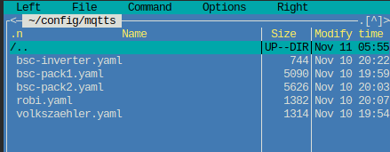
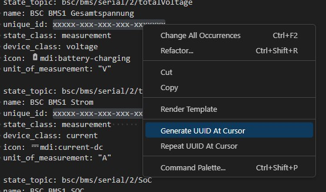
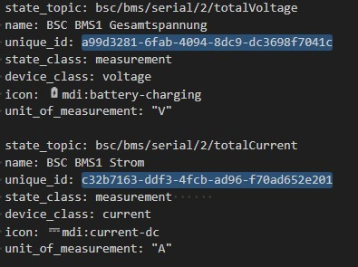

## Virtual Trigger

Es gibt 10 virtuelle Trigger (vTrigger) die per MQTT gesteuert werden können. Die virtuellen Trigger Daten gehen 1:1 auf die normalen Trigger über.

Um einen vTrigger "speichernd" zu erhalten, also über einen Reboot des BSC hinaus, kann dieser als "retain" an das BSC gesendet werden. Sobald das BSC wieder am Broker angemeldet wurde, wird der Trigger-Zustand dadurch direkt wieder mit dem BSC aktualisiert.  

Zusätzlich kann für jeden vTrigger festgelegt werden, ob er speichernd sein soll. Diese Einstellungen befinden sich unter „System“ bei den [MQTT-Optionen](settings_bsc.md/#mqtt).

## Beispiel
Wird der vtrigger 1 aktiviert, dann wird auch Trigger 1 aktiv.

`{Device Name}/input/vtrigger/{Trigger Nummer}`

{Device Name}: Der Device Name aus den System-Settings  
{Trigger Nummer}: Triggernummer von 1 bis 10

Payload:  
0 -> Trigger Low  
1 -> Trigger High

## MQTT in Home-Assistant integrieren
Um die Übersichtlichkeit der configuration.yaml zu wahren, können getrennte MQTT-Config-Dateien genutzt werden.  
Sinnvoll ist es z.B. pro angebundener Hardware eine Datei zu generieren.  

Folgende Programmzeile ist in der "config/configuration.yaml" zu hinterlegen:

```yaml
mqtt:
  - sensor: !include_dir_merge_list mqtts/
```
Die einzelnen MQTT-Konfigurationen werden dann in einem Unterverzeichnis namens "mqtts" hinterlegt.
Dieses muss händisch erstellt werden.



Nun müssen die .yaml Dateien an dieser Stelle abgelegt werden.
HomeAssistant wird jede der Dateien beim Boot einlesen und auswerten.

### Beispielkonfigurationen
Folgend findet Ihr Beispielkonfigurationen für verschiedene Hardware:

* BSC intern
* BMS
* Inverter
* Neey-Balancer

#### Konfiguration anpassen
Die Dateien müssen zur Integration statt ".txt" in ".yaml" umbenannt werden.
Leider unterstützt Github .yaml nicht.  

##### DataDevices
Der DataDeviceName muss von Ihnen, je nach BSC-Konfiguration, korrekt in den Dateien benamt werden.  
Die Stelle hierzu ist mit dem Kürzel "{DataDeviceName}" markiert.  
{DataDeviceName} = Definierter Klartext-Name im Data device mapping.

##### UniqueID
Innerhalb der Dateien gibt es pro Sensorwert eine UniqueID welche von jedem definiert werden muss.  
Generieren kann man diese beispielsweise mit der "Version 1" auf https://www.uuidgenerator.net/version1 .

Alternativ kann man sehr komfortabel über das Addon namens "Visual Studio Code Server" innerhalb Home-Assistant alle zu ersetzende UUIDs auf einmal ändern.
Die selbe Vorgehensweise funktioniert über VisualStudioCode mit dem Addon "UUID Generator von netcorext".

- Markieren des temporären Strings "xxxxx-xxx-xxx-xxx-xxxxx"
- Rechtsklick -> "Change all Occurrences"  
  
- Rechtsklick -> "Generate UUID at Cursor"  

  
=> Speichern

#### Dateien

[BSC-Internal.txt](files/mqtt_internal.txt)  
[BSC-Inverter.txt](files/mqtt_inverter.txt)  
[BSC-BMS-DataDevice.txt](files/bsc_bms_datadevice.txt)  
[BSC-Neey1_BLE.txt](files/mqtt_neey1_ble.txt)

### Vorhandene MQTT-Konfiguration in neuem Verzeichnis integrieren
Wenn im Vorhinein eine dedizierte mqtt.yaml im Config-Hauptverzeichnis verwendet wurde, kann diese einfach in das soeben erzeugte Verzeichnis kopiert und genutzt werden.  
Hierbei ist zu beachten, dass in den ausgegliederten Konfigurationsdateien der Befehl "sensor:" nicht mehr vorhanden sein darf.  
Weiterhin müssen die Definitionen nun eine Tabulatorstelle nach links gerückt werden.  
```yaml
#### BSC Inverter

    - state_topic: bsc/inverter/chargeCurrentSoll
      name: DC-Ladestrom Soll
      unique_id: xxxxx-xxx-xxx-xxx-xxxxxxx
      state_class: measurement      
      device_class: current
      icon: mdi:current-dc
      unit_of_measurement: "A"
      device:
        {
          identifiers: ["BSC-Inverter"],
          manufacturer: "BSC",
          model: "BSC",
          name: "BSC-Inverter",
        }

    - state_topic: bsc/inverter/dischargeCurrentSoll
      name: DC-Entladestrom Soll
      unique_id: xxxxx-xxx-xxx-xxx-xxxxxxx
      state_class: measurement      
      device_class: current
      icon: mdi:current-dc
      unit_of_measurement: "A"
      device:
        {
          identifiers: ["BSC-Inverter"],
          manufacturer: "BSC",
          model: "BSC",
          name: "BSC-Inverter",
        }
```

### Nützliche Tools
Automatische Erstellung des BSC in HA: <a href="https://github.com/dominikfe/ha_bsc_discovery_automation" target="_blank">https://github.com/dominikfe/ha_bsc_discovery_automation</a> 