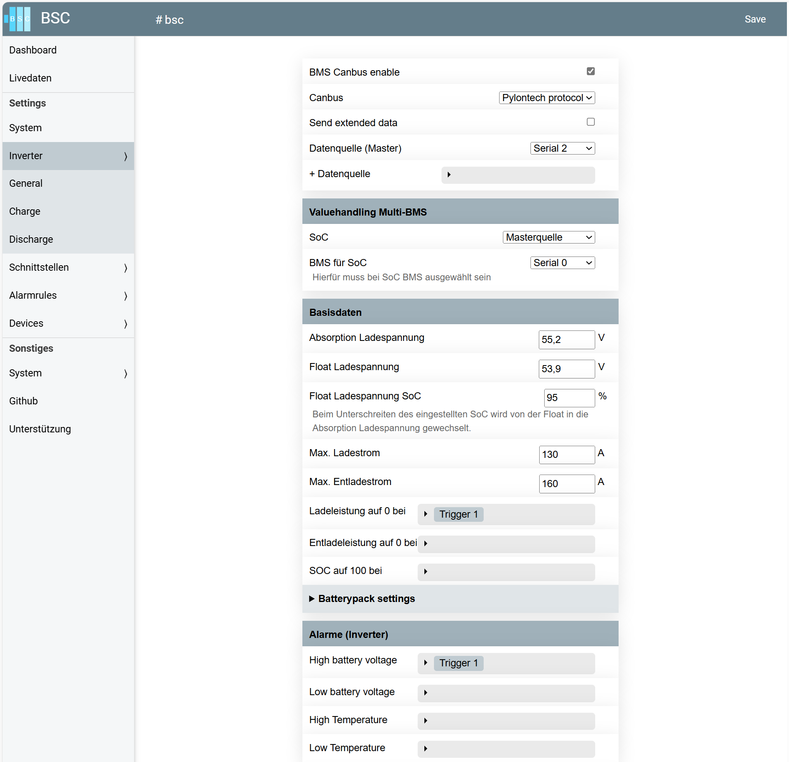
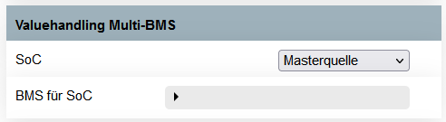
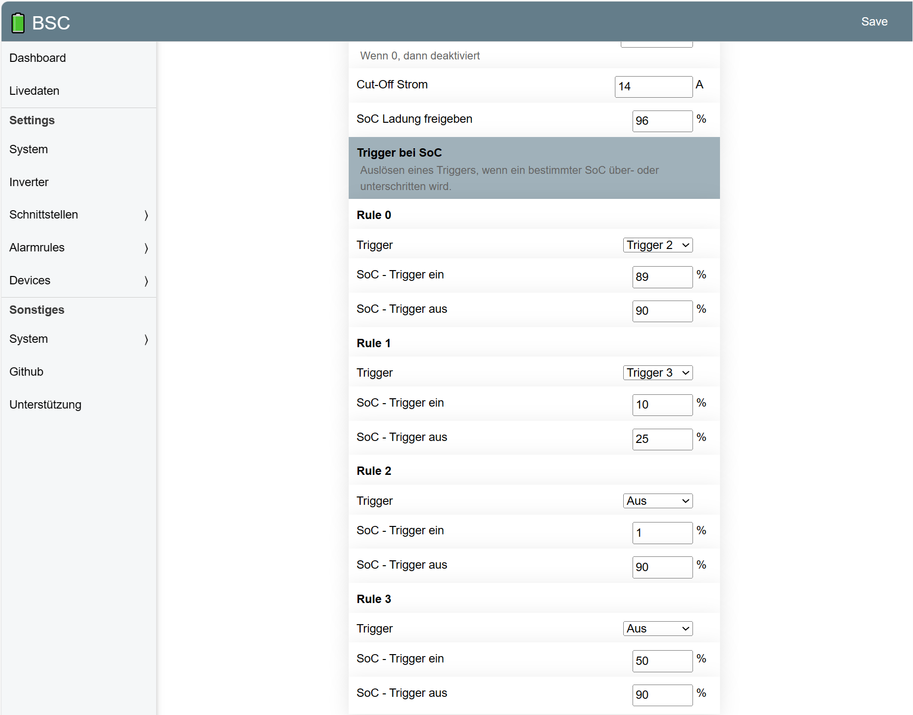
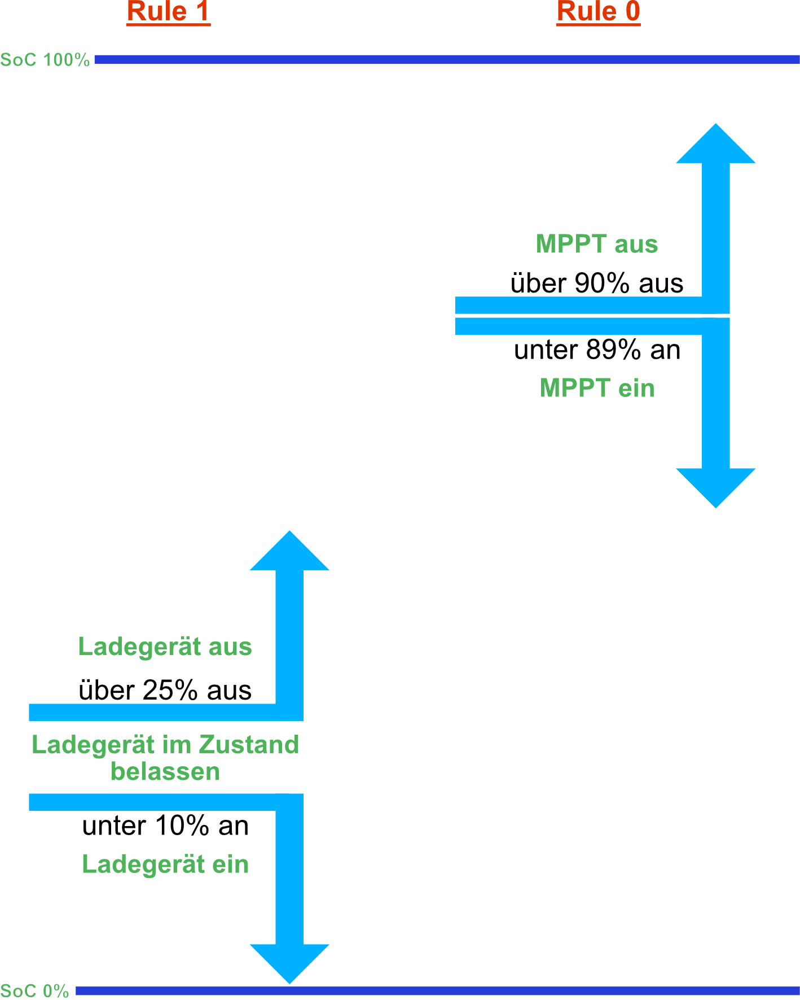
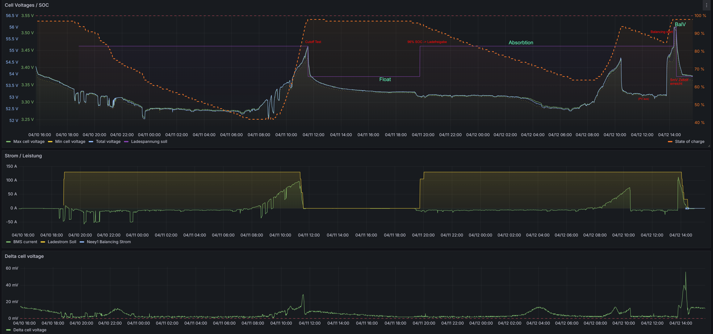
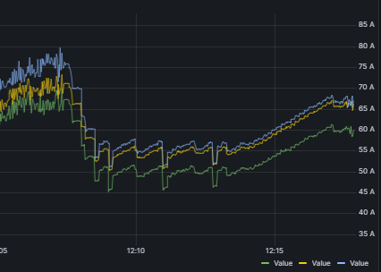
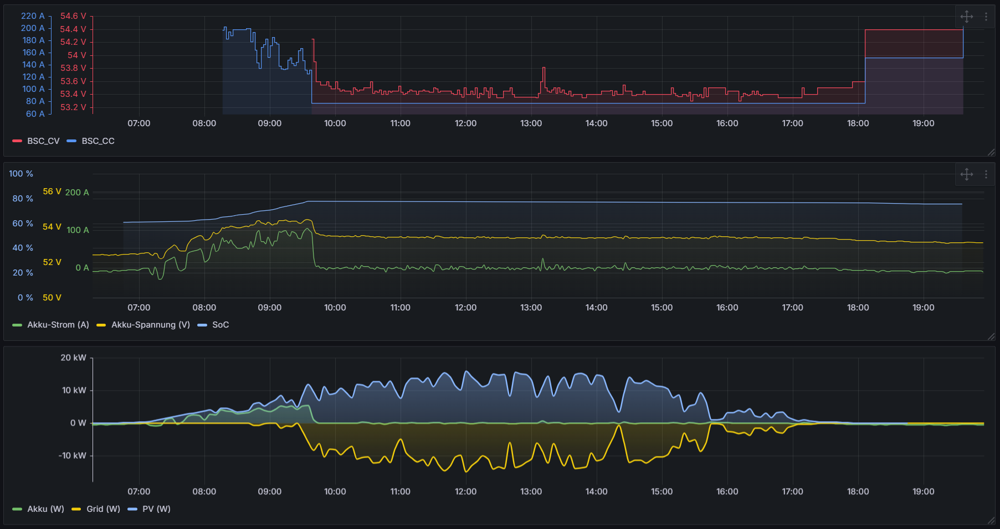
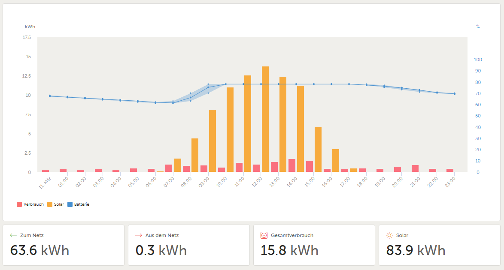
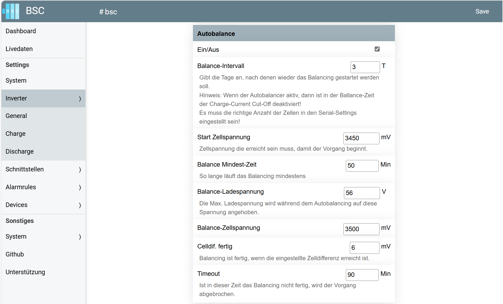
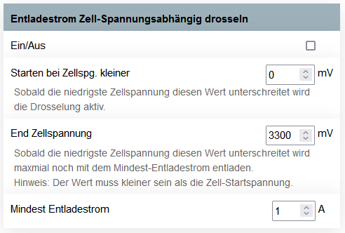

# Wechselrichter
In dieser Sektion können Sie neben der Definierung des angeschlossenen Inverters, das Lade- und Entladehandling definieren.  
Alle prozentualen Limitierungen werden auf die in der Kategorie "Basisdaten" eingestellten Werte angewendet.  
{  width="950" }  

## General
### CAN-Bus
Hier kann man das in Richtung Inverter zu nutzende Protokoll definieren.  
Die Einstellung "Send extended data" ist nur unter Umständen für eine angeschlossene Victron Anlage nutzbar. Weitere Informationen sind [hier](devices/wechselrichter.md#einstellungen-bsc) einsehbar.

### Valuehandling Multi-BMS
{  width="450" }  
Mit dem "Valuehandling Multi-BMS" haben Sie die Möglichkeit, den State of Charge (SoC) für die Übermittlung an den Inverter zu konfigurieren. Dies ermöglicht eine präzise Steuerung, welcher SoC-Wert verwendet wird, basierend auf den verschiedenen Quellen und Berechnungsmethoden. Die verfügbaren Optionen sind:

- **Masterquelle**  
Der SoC des Geräts, das unter der "Datenquelle (Master)" ausgewählt wurde, wird an den Inverter übermittelt.

- **SoC Mittelwert**  
Der Mittelwert des SoC aus allen unter "BMS für SoC" ausgewählten Geräten wird berechnet und an den Inverter übermittelt.

- **SoC Minimalwert**  
Der niedrigste SoC-Wert der unter "BMS für SoC" ausgewählten Geräte wird an den Inverter übermittelt.

- **SoC Maximalwert**  
Der höchste SoC-Wert der unter "BMS für SoC" ausgewählten Geräte wird an den Inverter übermittelt.

- **BMS**  
Der SoC eines einzelnen, unter "BMS für SoC" ausgewählten Geräts wird verwendet. Falls mehrere Geräte ausgewählt wurden, wird der SoC des ersten ausgewählten Geräts übermittelt.

Diese Einstellungen ermöglichen eine flexible Anpassung der SoC-Daten, die an den Inverter gesendet werden.

### Basisdaten
#### Absorption Ladespannung
Die **Absorption Ladespannung** bezeichnet die Spannung, die erforderlich ist, um Akkus in einen (nahezu) vollständig geladenen Zustand zu bringen. Dabei ist zu beachten, dass diese Spannung nicht dauerhaft anliegen sollte, da dies die Lebensdauer und Leistung des Akkus negativ beeinflussen kann.

Ein geeigneter Zeitpunkt, um von der **Absorptionsladespannung** zur **Float-Spannung** zu wechseln, liegt vor, wenn der Strom bei LiFePo4-Zellen über einen längeren Zeitraum hinweg sehr niedrig bleibt.

Um diesen Übergang automatisch zu steuern, steht die Funktion "**Charge-Current Cut-Off**" zur Verfügung, die im Folgenden beschrieben wird. Ohne diese Funktion bleibt der Akku dauerhaft auf der Absorptions-Spannung, was langfristig zu Schäden führen kann.

Diese Einstellung ist daher essenziell, um den Ladeprozess korrekt zu beenden und den Akku optimal zu schützen.

#### Float Ladespannung
Die Float Ladespannung gibt die Open-Circuit Voltage (OCV) an, also die Spannung, die eine Batterie erreicht, wenn sie sich im unbelasteten Zustand befindet und nicht geladen wird. 

Im Wesentlichen entspricht die Float Ladespannung dem Spannungswert, bei dem die Batterie in einem stabilen, ungenutzten Zustand verweilt, ohne zu entladen oder weiter aufgeladen zu werden. Dieser Zustand tritt auf, wenn keine Last auf der Batterie liegt und keine Energie in oder aus der Zelle fließt. 

#### Batterypack Settings
Mit dieser Funktion können Sie einen Lade- oder Entlade-Überstrom vermeiden, wenn einzelne Battery-Packs im System abgeschaltet werden. 

Das Battery-Safety-Controller (BSC) sorgt dafür, dass der zuvor definierte maximale Lade- und Entladestrom an den Inverter übermittelt wird. Je nach Anzahl der parallel geschalteten Packs müssen Sie diesen Stromwert individuell festlegen. Sollte nun ein Battery Management System (BMS) eines Packs eingreifen und das Pack vom Netz nehmen, besteht die Möglichkeit, dass die verbleibenden Packs den vollen Strom des ausgefallenen Packs übernehmen. Dies könnte zu einem Überstrom führen.

Um dies zu verhindern, können Sie mit dieser Funktion einen maximalen Strom pro Pack definieren. Das BSC reagiert automatisch auf den Ausfall eines Packs und passt den maximalen Strom an die verbleibenden Packs an, sodass der Strom nie den festgelegten Wert überschreitet.

Beispiel: Angenommen, Sie haben einen maximalen Ladestrom von 180A definiert und drei Packs, bei denen jeweils ein maximaler Strom von 100A festgelegt ist. Sollte nun ein Pack ausfallen, würde der verbleibende Strom von 200A noch innerhalb des zulässigen Rahmens liegen. Fällt ein weiteres Pack aus, würde der Ladecontroller den Strom automatisch auf 100A begrenzen, um das verbleibende Pack vor einem Überstrom zu schützen.

Diese Funktion gewährleistet, dass Ihr System auch bei Ausfall von einzelnen Packs stets sicher arbeitet und keine Überstromsituationen entstehen.

### Trigger bei SoC
Mit dieser Funktion kann man beispielsweise externe Gerät je nach SoC-Wert schalten.  
{  width="950" }  

**Zwei Beispiele hierzu:**    
{  width="450" }  

Hier triggert...  

* Rule0 ein Relais für einen MPPT-Ladecontroller  
  * <= 89% einschalten
  * &gt;= 90% ausschalten

* Rule1 ein Relais für ein Ladegerät eines Offgrid-Systems  
  * <= 10% einschalten
  * &gt;= 25% ausschalten

Das Ladegerät geht bei 0% an, bis die 25% erreicht sind und schaltet dann aus. Erst bei 10% und kleiner wird es wieder gestartet.  
Somit hat man eine Hysterese von 15%.

## Charge
Beispiel eines Ladezyklus inkl. Balancing-, Float- und Absorption-Voltage mit Hilfe des BSC und einer Visualisierung über HomeAssistant/Grafana:  
{  width="1300" }   

### Ladestrom pro Pack zu groß
{  width="450" }  
Mit dieser Funktion wird der Ladestrom automatisch und dynamisch angepasst, um sicherzustellen, dass der maximale Ladewert eines jeden Batterie-Packs nicht überschritten wird. Diese intelligente Regelung schützt die Batterie vor Überstrom.

Die folgende Grafik veranschaulicht die Ströme von drei Batteriepacks während eines Ladeprozesses:
{  width="600" }  
Grün zeigt den Stromverlauf für Pack 1, Gelb von Pack 2 und Blau von Pack 3.

In der Darstellung ist zu erkennen, dass der maximale Laststrom für Pack 1 (grün) für eine kurze Zeit auf 50A reduziert wurde (dies ist in der Mitte des Diagramms sichtbar). Nachdem der Wert reduzierte wurde, regelt das (BSC) den Ladestrom dynamisch herunter und hält ihn auf den eingestellten Wert von 50A.

### Ladestrom Zell-Spannungsabhängig drosseln
Diese Einstellungen ermöglichen es, den Ladestrom zu drosseln, wenn bestimmte Zellspannungen überschritten werden. Dies hilft, die Zellen vor Überladung zu schützen.

* **Ein/Aus:** Aktivieren oder Deaktivieren der Funktion.
* **Starten bei Zellspannung größer:** Gibt die Zellspannung an, bei der die Drosselung des Ladestroms beginnt.
* **Maximale Zellspannung:** Ab dieser Zellspannung wird nur noch mit dem Mindest-Ladestrom geladen.
* **Mindest-Ladestrom:** Der niedrigste Strom, der beim Laden verwendet wird.

### Ladestrom reduzieren bei Zelldrift
Diese Funktion reduziert den Ladestrom basierend auf der Zellspannungsdifferenz (Drift), um eine gleichmäßige Ladung der Zellen sicherzustellen.

* **Ein/Aus:** Aktivieren oder Deaktivieren der Funktion.
* **Starten bei Zellspannung größer:** Zellspannung, ab der die Reduzierung des Ladestroms beginnt.
* **Starten bei Drift größer:** Die Spannungsdifferenz zwischen Zellen, bei der die Reduzierung startet.
* **Reduzierung pro weiterer mV-Abweichung um:** Stromreduktion für jede weitere mV-Abweichung an Zellspannungsunterschied gegenüber der gesetzten Startdefinition.

### Ladestrom reduzieren - SoC
Der Ladestrom wird reduziert, wenn der Ladezustand (State of Charge, SoC) einen bestimmten Wert überschreitet.

* **Ein/Aus:** Aktivieren oder Deaktivieren der Funktion.
* **Reduzierung ab SoC:** Der Ladezustand (SoC), ab dem der Ladestrom reduziert wird.
* **Pro 1% um x A reduzieren:** Gibt an, um wie viel der Strom pro 1% SoC reduziert werden soll.
* **Mindest-Ladestrom:** Der niedrigste Strom, der beim Laden verwendet wird.

### Dynamische Ladespannungsbegrenzung (Beta!) 
Diese experimentelle Funktion begrenzt die Ladespannung basierend auf der Zellspannung und dem Spannungsunterschied zwischen den Zellen.

* **Ein/Aus:** Aktivieren oder Deaktivieren der Funktion.
* **Start-Zellspannung:** Zellspannung, ab der die Begrenzung aktiv wird.
* **Spannungs-Delta Min/Max:** Der maximale Unterschied zwischen der niedrigsten und höchsten Zellspannung.

### Spannungsregelung zur Ladestrombegrenzung
> Diese Funktionen steht nur Insidern zur Verfügung  

Sobald die Funktion aktiviert ist, wird die Ladespannung dynamisch angepasst, um den Ladestrom innerhalb des konfigurierten Korridors zu halten. Sollte der Ladestrom den definierten Bereich überschreiten oder unterschreiten, greift die Spannungsregelung ein und korrigiert die Spannung entsprechend. Zusätzlich wird der an den Wechselrichter übermittelte Ladestrom auf 0 A gesetzt.  

Die Regelung tritt ausschließlich in Kraft, wenn der Autobalancer nicht aktiv ist.  

Die Diagramme zeigen eine Victron-Anlage mit aktivierter Spannungsregelung. Deutlich erkennbar ist, dass der Ladestrom begrenzt wird und keine Energie in den Akku fließt. Stattdessen wird die überschüssige Energie ins Netz eingespeist, während der SoC (State of Charge) über die Zeit nahezu konstant bleibt.
{ width="950" }  
{ width="950" }  

**Einstellmöglichkeiten:**

* **Ein/Aus:** Die Regelung kann entweder dauerhaft aktiviert oder deaktiviert werden.  
Alternativ ist es möglich, sie nur dann zu aktivieren, wenn eine definierte Triggerbedingung erfüllt ist. Dadurch lässt sich die Regelung beispielsweise in ein Home-Automation-System integrieren, sodass sie nur im Sommer aktiv ist und im Winter die volle Kapazität der Batterie zur Verfügung steht.
* **Aktiv ab (SoC):** Hier kann festgelegt werden, ab welchem Ladezustand (State of Charge, SoC) die Regelung in Kraft tritt. Dies ermöglicht eine gezielte Anpassung an verschiedene Anforderungen.
* **Regelungskorridor (±):** Definiert den zulässigen Schwankungsbereich für den Ladestrom. Innerhalb dieses Korridors erfolgt keine Regelung. Über- oder Unterschreitet der Ladestrom diesen Bereich, wird die Ladespannung automatisch angepasst.

**Anwendungsbereiche:**  
Die Funktion ermöglicht es, den Akku nur bis zu einem bestimmten SoC zu laden, um seine Lebensdauer zu verlängern.

### Autobalancer
Das Autobalance-Feature übernimmt die vollständige Balancierung Ihrer Akkuzellen, um eine optimale Leistung und Lebensdauer des Akkus sicherzustellen. Im Folgenden werden die wichtigsten Einstellungen und Abläufe beschrieben:
{  width="950" }  

**Autobal. starten (Trigger)** *(Diese Option steht nur Insidern zur Verfügung)*  
Der hier konfigurierte Trigger ermöglicht es, den Autobalancer unmittelbar zu starten, wenn er sich aktuell in der Wartezeit bis zum nächsten Intervall befindet. Zu beachten ist, dass der Trigger nach dem Starten des Autobalancers manuell wieder auf „Low“ gesetzt werden muss.

**Balance-Intervall**   
Mit dem Parameter Balance-Intervall kann festgelegt werden, in welchen zeitlichen Abständen ein Balancing der Akkuzellen durchgeführt werden soll. Dieser Wert bestimmt, wie häufig die Balancierung aktiviert wird, um die Zellspannungen anzugleichen.

**Startkriterien**   
Der Balancierungsprozess beginnt automatisch, wenn der definierte Balance-Intervall abgelaufen ist und im zweiten Schritt die Start-Zellspannung erreicht wurde.  
Für die Start-Zellspannung wird die höchste Zellspannung der konfigurierten Data-Devices genommen.  
Diese Startbedingungen stellen sicher, dass das Balancing unter optimalen Bedingungen durchgeführt wird.

**Balance Mindest-Zeit**   
Der Parameter Balance Mindest-Zeit gibt an, wie lange das Balancing mindestens durchgeführt werden soll, unabhängig davon, ob die Zellspannungen bereits ausgeglichen sind. Dies verhindert eine zu kurze Balancierungsdauer und sorgt für eine gründliche Anpassung der Zellspannungen.

**Balance-Ladespannung**   
Für den Balancierungsprozess wird die Ladespannung des Systems auf die vorab definierte Balance-Ladespannung angehoben. Diese Spannung sorgt dafür, dass der Balancierungsvorgang effektiv durchgeführt werden kann.

**Balance-Zellspannung**   
Der Parameter Balance-Zellspannung gibt an, wie hoch die Spannung der einzelnen Zellen während des Balancing-Vorgangs maximal ansteigen darf. Dies verhindert eine Überladung der Zellen und schützt das Akkusystem vor Schäden.

**Beendigung des Balancierungsprozesses**   
Der Vorgang wird automatisch beendet, sobald die Differenz zwischen den Zellspannungen den eingestellten Wert erreicht oder unterschreitet. Dadurch wird sichergestellt, dass alle Zellen gleichmäßig geladen sind und keine übermäßige Disparität besteht.

**Timeout**   
Mit dem Parameter Timeout wird festgelegt, nach welcher maximalen Zeit der Balancierungsprozess automatisch abgebrochen wird, falls die Zellspannungen nicht innerhalb des vorgesehenen Zeitrahmens ausgeglichen werden konnten. Dies schützt das System vor endlosen Balancierungszyklen.

**Erweiterte Optionen**  
> Hinweis: Die Erweiterten Optionen sind nur in der [Insider Version](insider.md) verfügbar

- **Ballance-Spg. senden, sobald Startzeitpunkt erreicht**  
Wenn diese Option aktiviert ist, wird die Balance-Spannung gesendet, sobald der festgelegte Startzeitpunkt erreicht ist.  
- **Bei Start-Zellspg.-Unterschreitung → Step 'Warte auf Start-Zellspg.'**  
Ist diese Option aktiv, wird bei Unterschreiten der definierten Start-Zellspannung erneut in den Schritt *„Warte auf Start-Zellspg.“* gewechselt. Dadurch werden auch die laufenden Timer zurückgesetzt.  
- **CutOff ab Step 'Warte auf Start-Zellspg.' deaktivieren**  
Mit dieser Option wird die CutOff-Funktion bereits im Schritt *„Warte auf Start-Zellspg.“* deaktiviert.  

**Nach dem Balancing**   
Nach Abschluss des Balancierungsprozesses wird die Ladespannung auf das Floating-Niveau abgesenkt, um den Akku im geladenen Zustand zu halten, ohne ihn weiter zu belasten.

Dieses Autobalance-Feature bietet eine automatisierte Lösung, um die Akkuzellen regelmäßig zu balancieren und damit die Effizienz und Lebensdauer des Akkus zu maximieren.     

**Hinweise**

* Nach einem Neustart des BSC ist keine Wartezeit bis zum ersten Balancing. Erst nach dem ersten Balancing startet der eingestellte Balance-Interval.
* Wenn das BSC Abends um 22:00Uhr gestartet wurde und ein Intervall von fünf Tagen eingestellt ist, wird es nicht am Morgen des fünften Tages balancieren, sondern erst am nächsten, wenn die Sonne wieder auf geht!  Denn das Balancen würde erst am Abend des fünften Tages scharf geschaltet werden
* Für verschiedene BMS, z.B. dem Seplos, kann die einstellbare Mindestzeit genutzt werden, um den SoC 100 zu setzen   

Den genauen Ablauf des Balance-Vorgangs kann mit dem MQTT-Topic "/Inverter/autoBalState" visualisiert werden.  
Funktion der fünf verfügbaren States:

  - 0: Autobalancing ist deaktiviert
  - 1: BSC wartet auf den nächsten Startzeitpunkt
  - 2: Balancing wurde nicht fertig und es wird am nächsten Tag wiederholt
  - 3: Startzeitpunkt erreicht; BSC wartet auf die Start-Zellspannung
  - 4: Start-Zellspannung erreicht; Autoblancing ist jetzt aktiv
  - 5: Celldif. fertig wurde erreicht, aber die Balance-Ladespannung ist noch nicht erreicht
  - 6: Balance-Ladespannung erreicht; warten bis Mindestzeit abgelaufen

### Charge-Current Cut-Off
Diese Funktion unterbricht den Ladestrom, wenn er für eine bestimmte Zeitspanne unterhalb einem eingestellten Strom-Wert liegt.  
Nach diesem Abbruch wird die bisher verwendete Soll-Lade-Spannung von der Absorption-Spannung auf die Float-Spannung gesetzt.  

* **Ein/Aus:** Aktivieren oder Deaktivieren der Funktion.
* **Cut-Off Time:** Zeitspanne, in der der Ladestrom unter einem bestimmten Wert liegen muss, bevor er auf 0 A gesetzt wird.
* **Cut-Off Strom:** Der Cut-Off-Strom ist der Gesamt-Ladestrom, unterhalb dessen die Cut-Off-Zeit beginnt. Der Gesamt-Ladestrom wird als Mittelwert berechnet, seit die eingestellte Start-Zellspannung (falls vorhanden) überschritten wurde.  
Überschreitet während des Prozesses der Mittelwert des Gesamt-Ladestroms erneut den Cut-Off-Strom, setzt sich sowohl der Timer als auch der Mittelwert zurück.
* **Start-Zellspannung:** Die Start-Zellspannung ist die Spannung, ab der die Cut-Off-Regelung aktiv wird. Sobald diese überschritten wurde und der Cut-Off-Strom unterschritten ist, bleibt der Timer aktiv.  
Ein erneutes Unterschreiten der Start-Zellspannung führt nicht zum Abbruch des Timers. Der Timer wird ausschließlich zurückgesetzt, wenn der Cut-Off-Strom erneut überschritten wird.

### SoC beim Unterschreiten der Zellspannung
Diese Funktion steuert das Nachladen der Zellen basierend auf der Zellspannung.

* **Ein/Aus:** Aktivieren oder Deaktivieren der Funktion.
* **Zellspannung Ladebeginn:** Zellspannung, bei der das Nachladen startet.
* **Zellspannung Ladeende:** Zellspannung, bei der das Nachladen endet.
* **SoC:** Ladezustand, der während des Nachladens an den Wechselrichter gesendet wird.
* **Sperrzeit zwischen zwei Nachladungen:** Zeit, die zwischen zwei Nachladungen vergehen muss.

## Discharge
### Entladestrom Zell-Spannungsabhängig drosseln
{  width="450" }  

Diese Funktion dient der Anpassung des Entladestroms basierend auf der Zellspannung, um die Lebensdauer der Batteriezellen zu verlängern und deren Sicherheit zu gewährleisten.

- **Ein/Aus** (Aktivierung der Drosselung)  
Diese Option ermöglicht es, die Zellspannungsabhängige Drosselung ein- oder auszuschalten.  
Wenn aktiviert, wird der Entladestrom in Abhängigkeit von der Zellspannung angepasst.

- **Starten bei Zellspannung kleiner als**  
Hier wird ein Schwellenwert festgelegt, bei dessen Unterschreitung die Drosselung des Entladestroms aktiviert wird.  
Sobald die niedrigste Zellspannung diesen Wert unterschreitet, wird die Drosselung in Kraft gesetzt, um die Zellen nicht zu stark zu entladen.

- **End Zellspannung**  
Dieser Wert legt die Zellspannung fest, bei deren Unterschreitung der Entladestrom auf den "Mindest-Entladestrom" reduziert wird.  
> Hinweis: Der End Zellspannung-Wert muss immer kleiner als die Zell-Startspannung eingestellt werden!

- **Mindest-Entladestrom**  
Dies ist der minimale Entladestrom, der bei Unterschreiten der End Zellspannung nicht unterschritten wird.
