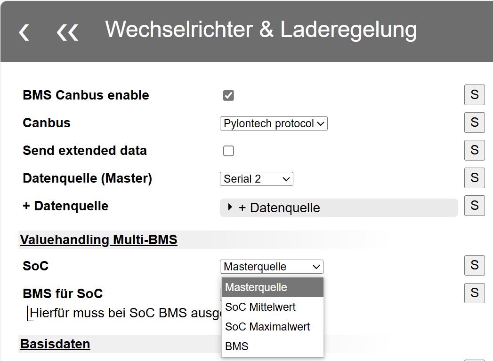
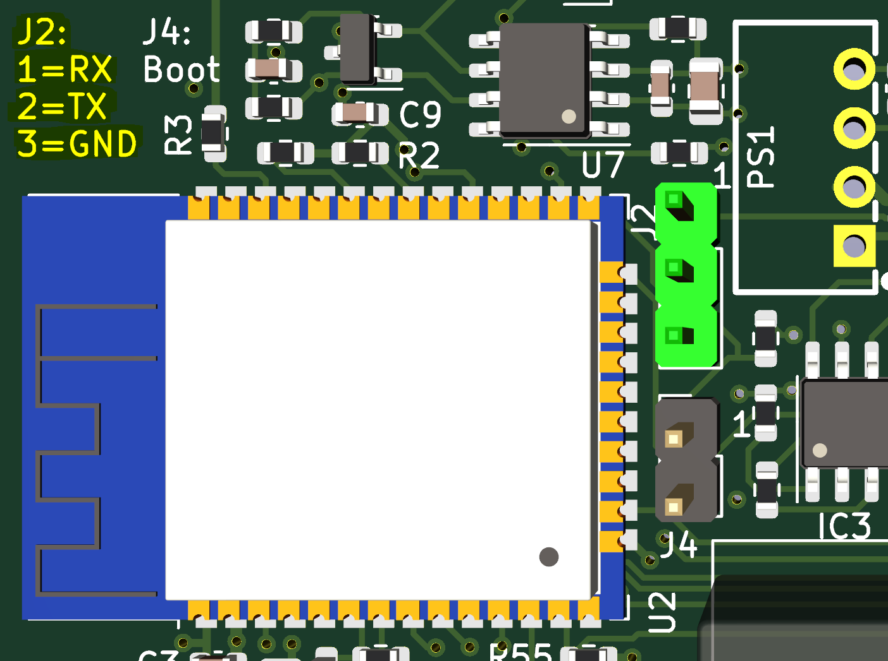
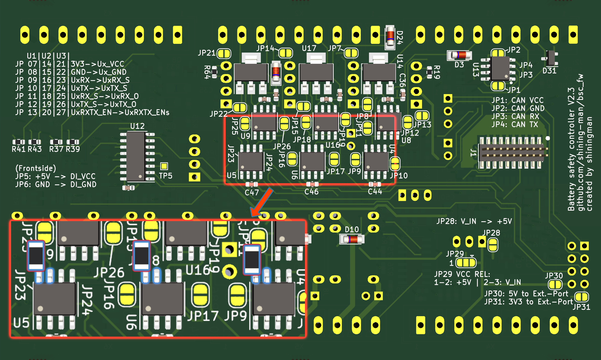
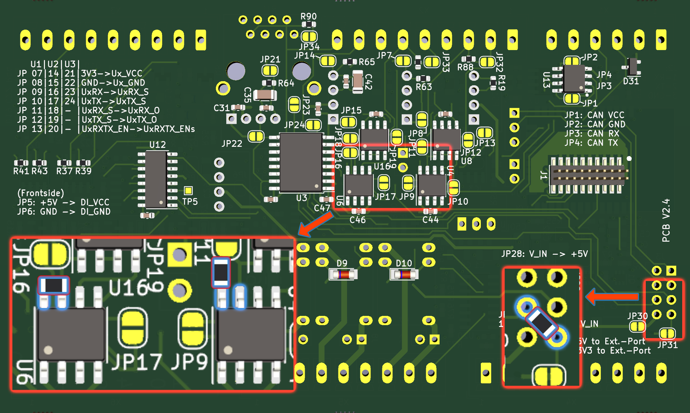
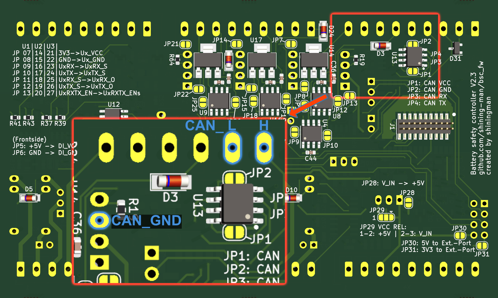

## Software

### Der SoC Wert des BMS und der zum Inverter übertragene Wert stimmen nicht überein
Hier gibt es drei Möglichkeiten, die dies "verursachen" können.  

1) Die Einstellung der SoC-Quelle ist falsch definiert.  
{  width="400" }  

2) Wenn die Masterquelle 5s ausgefallen ist, wird der SoC von einem noch verfügbaren Gerät übernommen. Sobald die Masterquelle wieder zur Verfügung steht, wird auf dieses wieder zurück geschaltet.

3) Der Betriebsmodus 2 der SoC-Value Adjustments ist aktiv geschaltet und linearisiert den SoC zwischen den eingestellten Spannungswerten.  
Bitte wechseln Sie im Menü auf /Einstellungen/Schnittstellen/Serial und scrollen zu den "Value adjustments".  
Hier sollten keine zwei Werte pro Schnittstelle gesetzt sein, wenn ein BMS mit SoC-Kalkulation genutzt wird.  
Weitere Informationen finden Sie [hier](settings_bsc.md#serial) unter "Betriebsmodus 2: Lineare SoC-Berechnung zwischen zwei Zellspannungsschwellen".

### Log-Eintrag: "MQTT Queue ist voll"
Dieses Problem kann auftreten, wenn der Broker nicht innerhalb einer bestimmten Zeit alle Daten aus der Queue abrufen kann.

**Mögliche Ursache:**  
Ein Benutzer berichtete von Schwierigkeiten in einer Umgebung mit einem Docker-Container, der mehrere integrierte Applikationen enthielt.

**Lösung:**  
Die Aufteilung auf mehrere Docker-Container eliminierte das Problem. Es kann daher hilfreich sein, die Last durch eine solche Architekturänderung zu verteilen.

### Serial Debugging
Bei schwierig nachvollziehbaren Fehlern können spezielle Firmware-Versionen zur Fehlersuche bereit gestellt werden.  
Diese Versionen geben über die am BSC verbaute Programmier-Schnittstelle erweiterte Informationen zur Fehlereingrenzung aus.  
Hierzu wird die Serial0 verwendet, an die bei dem Prozess kein externes Gerät über RS485 angeschlossen werden darf.  
Das interne, in der WebUI erreichbare Log, ist bei diesen Versionen deaktiv geschaltet und zeigt nur die vorherigen Events der Altversion an.  

Um diesen Datenstream zu erfassen ist ein UART/USB Konverter mit <u>3,3V Pegel</u> und ein PC-Programm von Nöten.  
Als Konverter können verschiedenste Hersteller genutzt werden, gut funktionierend haben sich Adapter mit einem FT232R-Chip erwiesen. Oft funktionieren auch Adapter mit einem CP340G Chip.  
Adapter, die nicht für 3,3V ausgelegt sind, können den Controller irreparabel schädigen!

Anzuschließen ist der Konverter über die dreipolige Stiftleiste "J2" neben dem Prozessor.  
Die jeweilige Signalbezeichnung der Pins ist an der linken oberen Ecke der Platine aufgedruckt.

- TX kommt hierbei an RX
- RX an TX
- GND an GND

{  width="400" }  

Als PC-Programm unter Windows hat sich "Putty", "YAT" und "HTERM" bewährt.  
Die serielle Schnittstelle wird als "COM-Port" bezeichnet. Die richtige Nummer derer finden Sie im Windows-Gerätemanager unter "Anschlüsse (COM & LPT)".  
Die Datenverbindungs-Parameter sind 115200baud, 8bit, keine Parität, Ein Stoppbit.  
Zum Testen der Verbindung kann das BSC einmal aus und wieder eingeschaltet werden. Dabei werden Informationen an den PC gesendet.  

Ein kurzes **Video** dazu findet Ihr im Übrigen [hier](mov/serial_debugging.mp4).  

## Hardware

### Kommunikation mit externer Hardware funktioniert nicht
Bitte prüfen Sie nochmals alle angeschlossenen Verbindungen.  
Jeder Stecker hat eine **auf der Leiterplatte aufgedruckte** Pin1 Markierung.  
Diese muss mit der abgedruckten Signal-Information und der angeschlossenen Leitung überein stimmen!

#### CAN-Kontaktierung prüfen
**1)**  
Bei einer CAN-Verbindung sollte zwischen beiden Datenleitungen (L / H) pro angeschlossener Seite ein Widerstand von 120Ohm zu messen sein.  
Dies kann man überprüfen, in dem man die Geräte beider Seiten stromlos schaltet und ohne angeschlossener Verbindung mit einem Multimeter den Widerstand zwischen CAN_L und CAN_H pro Seite misst.  

Ab und an gibt es Geräte ohne diesen eingebauten Widerstand, dann misst man nur auf der BSC-Seite 120Ohm.  
Hier sollte man jedoch hellhörig werden und die Pinbelegung nochmals akribisch checken, da dies untypisch ist.  

Wenn beidseitig 120Ohm vorhanden sind, kann man beide Geräte miteinander verbinden und im stromlosen Zustand den Widerstand an den Signalleitungen nochmals messen.  
Nun sollten am Multimeter 60Ohm angezeigt werden.  

**2)**  
Bei einer CAN-Schnittstelle müssen immer "CAN_H mit der Gegenseite CAN_H" und "CAN_L mit der Gegenseite CAN_L" angeschlossen werden.
Dies ist zu prüfen.  
Weiterhin ist das GND-Signal beidseitig zu kontaktieren.

#### Serial 2 ohne Funktion / keine Datenverbindung möglich (Nur Timeouts im Log)
Bitte schauen Sie, ob der Jumper J6 auf der Platine gesetzt wurde.  
Weitere Infos [hier](hardware.md#j6-fur-den-regularen-betrieb).

### Sporadische CRC Fehler an den seriellen Schnittstellen (HW2.3 und HW2.4)
Aufgrund fehlender Pullups an den RX-Signalen der seriellen Schnittstellen, kann es zu einem Floaten des Signals kommen. Abhilfe schafft hierbei das Einfügen von 10kOhm Pullup-Widerständen.  
  
Bezüglich der Baugrößen verwendbarer Widerstände kommt es sehr auf das eigene Können des Lötens an.  
- Zwischen den Pins ist 0603 beispielweise passend. 0805 ist aber auch möglich
- Vertikal zu dem Lötpad würde 1206 sehr gut funktionieren, 0805 ist aber auch möglich
- Zwischen den THT-Pins von J3 funktioniert 0805 genau so wie 1206

#### HW2.3
**Serial 0+1+2**  
Bei Serial 0, 1, 2 muss der 10kOhm Widerstand an U4, U5 und U6 jeweils zwischen Pin 7 und 8 eingelötet werden.  
Für einfacheres Löten kann bei allen ICs die Kontaktierung etwas weiter oben genutzt werden.  

Platinenansicht von unten:  
{  width="800" }

#### HW2.4
**Serial 0+1**  
Bei Serial 0 und 1 muss der 10kOhm Widerstand an U4 und U6 jeweils zwischen Pin 7 und 8 eingelötet werden.  
Bei U4 ist es evtl. einfacher dies wie im Bild zu kontaktieren.

**Serial 2**  
Bei Serial 2 muss der 10kOhm Widerstand zwischen Pin 6 und Pin 7 des Steckers J3 eingesetzt werden.   
Dies lässt sich auch ganz gut mit einem bedrahteten Widerstand (THT) tätigen.  

Platinenansicht von unten:  
{  width="800" }

### CAN_GND Kontaktierung (HW2.3)
Über die Schraubklemmen der Hardware ist CAN_L & CAN_H kontaktierbar.  
Der dazugehörige CAN_GND fehlt hier und muss daher auf der Leiterplatten-Unterseite über die Pins des Spannungsreglers abgegriffen werden.  

Platinenansicht von unten:  
{  width="800" }